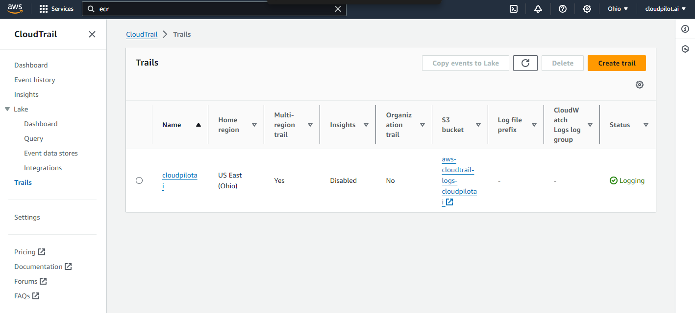

Amazon ECR requires repositories to pre-exist before pushing container images. Therefore, when you want to push a container image to ECR, you need to create the repository first, which can be an expensive operation. This documentation explains how to create the repository automatically when you push an image to ECR.

Refer to [AWS official documentation](https://aws.amazon.com/blogs/containers/dynamically-create-repositories-upon-image-push-to-amazon-ecr/), but with bug fixes.

### 1. Clone the Repository

```sh
git clone https://github.com/cloudpilot-ai/amazon-ecr-dynamic-repository-creation.git
```

### 2. Initialize the Environment

```sh
terraform init
terraform apply -auto-approve
```

### 3. Create a CloudTrail Trail

Go to the `CloudTrail dashboard` and create a trail for your account with the default configuration (if there is no existing trail).


### 4. Log In to ECR

```sh
aws ecr get-login-password --region <region> | docker login --username AWS --password-stdin <your_account_id>.dkr.ecr.<region>.amazonaws.com
```

### 5. Push Image to ECR

```sh
docker pull nginx:latest
docker tag nginx:latest <your_account_id>.dkr.ecr.<region>.amazonaws.com/nginx:latest
docker push <your_account_id>.dkr.ecr.<region>.amazonaws.com/nginx:latest
```

### 6. Enjoy!

Now, everything is ready. If you want to clean up the resources, please use the `terraform destroy` command. Additionally, delete the created resources in the `CloudTrail dashboard`.
