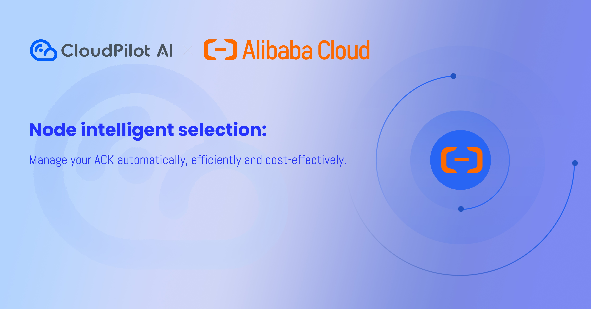
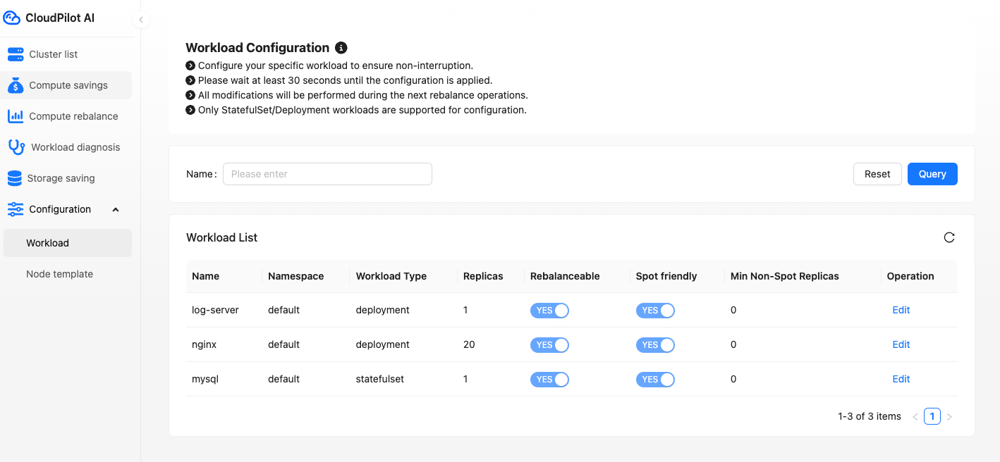

import workloadcfg from './img/1-9-0-workloadcfg.png';

✨✨✨ The most recent release brings some solid new features, enhancements, and bug fixes that should enhance your experience. Check out what's changed:

### 🚀 **Highlights**

#### **Support for Alibaba Cloud ACK Optimization**

CloudPilot AI now supports optimizing Alibaba Cloud ACK clusters. In just two steps and five minutes, you can significantly reduce your ACK cluster costs while also enhancing your management efficiency.

CloudPilot AI helps you:

- Scale out the most suitable ECS instances to quickly run your workloads.
- Scale in nodes efficiently when utilization is low.
- Provide a user-friendly dashboard for cost monitoring.
- Enable easy automation and management of your cluster's data plane, such as upgrading.
- Offer highly customizable node configuration capabilities.
- Use Spot instances to cut cluster costs without compromising availability.

Enjoy a cost-efficient and efficient journey on ACK with CloudPilot AI!

#### **Proactively Maintaining Workload Distribution as Configured**

Previously, if you modified the workload configuration in CloudPilot AI (see the configuration page below), such as changing from spot-friendly to non-spot-friendly, all changes would take effect during the next rebalance operation, not in real-time:

Now, CloudPilot AI applies the changes immediately to ensure the workload distribution meets your requirements.

### ⚙️ Enhancements
- Support configuring flexible node capacity types: Spot or On-Demand. 
- Reduced the delay for converting to a cheaper Spot node from 1 day to 1 minute to further optimize overall costs.
- Ignore PDB configurations. If the optimization plan meets errors, provide an optimized result whenever possible.
- Since StatefulSets do not support rolling updates, use the evict API directly for single-node workloads. If high availability is required, ensure that the number of replicas in a StatefulSet is greater than one.

### 🛠️ Bug Fixes
- Ensure that Pods of the same workload (e.g., Deployment) are scheduled on at least two nodes instead of three as before.
- When selecting subnets, only choose those within user-configured zones to prevent node creation failures.

We believe these updates further enhance CloudPilot AI's performance, efficiency, and usability. For any questions or support, feel free to connect with us via our [Slack channel](https://app.slack.com/client/T073TAAS5FW/C073J7ECB9C).  

Stay tuned for more updates! 🚀