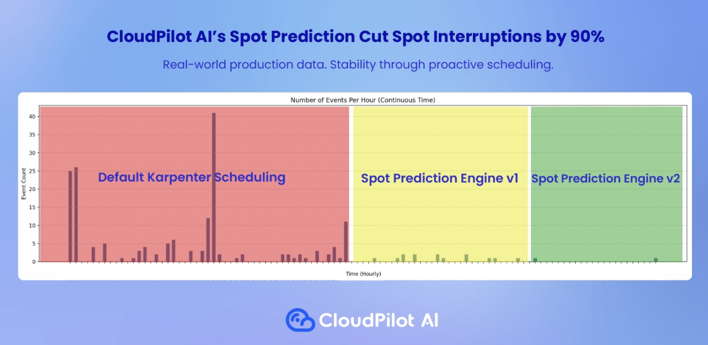

# April 2025 - v1.10.0

### 🚀 **Highlights**

#### **Ignore Specific Nodes During Optimization**

In some scenarios, you may want CloudPilot AI to optimize only a subset of nodes—for example, when you're gradually rolling out optimizations to test stability, or when certain nodes are covered by Savings Plans or Reserved Instances.

To exclude nodes from optimization, simply add the annotation karpenter.sh/do-not-disrupt: "true" to the nodes you want to preserve. For example:
```sh
$ kubectl get node
NAME                       STATUS   ROLES    AGE    VERSION
node-01.172.16.0.167       Ready    <none>   60m    v1.31.1-k8s.1
node-02.172.16.3.212       Ready    <none>   2m8s   v1.31.1-k8s.1
 
$ kubectl annotate node node-01.172.16.0.167 karpenter.sh/do-not-disrupt=true
node/node-01.172.16.0.167 annotated
```

Once annotated, the node will be excluded from any optimization actions. You can verify this behavior in the CloudPilot AI console.

#### **Enhanced Spot Instance Prediction Algorithm (v2)**

The next-generation prediction algorithm for spot instances is now available in CloudPilot AI. It leverages more contextual data to anticipate upcoming spot interruptions, allowing your workloads to migrate ahead of time with greater reliability.

This enhancement helps you use spot instances more confidently, even for production workloads.

The figure below demonstrates how the v2 algorithm proactively migrates workloads ahead of upcoming spot events, resulting in a significant reduction in spot-related disruptions.


### ⚙️ Enhancements

* Ensure replicas are scheduled across at least two nodes for unknown workload types, especially for custom resources (CRs).
* Display real-time optimization plans whenever workload configurations are updated.

### 🛠️ Bug Fixes

* Fixed an issue in the onboarding process where multiple node groups shared the same name in CloudPilot AI.
* Corrected AWS node capacity extraction to improve pricing accuracy.
* Resolved an issue where nodes were repeatedly recreated or deleted, improving overall system stability.

We believe these updates further enhance CloudPilot AI's performance, efficiency, and usability. For any questions or support, feel free to connect with us via our [Slack channel](https://join.slack.com/t/cloudpilotai/shared_invite/zt-36q9wpyol-N2X3izL~HZcf1_QSko6~6Q).  

Stay tuned for more updates! 🚀