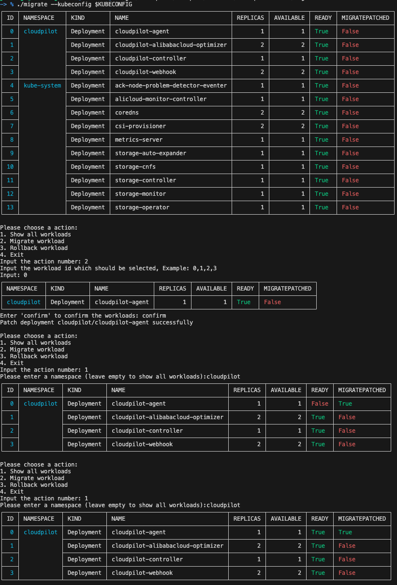
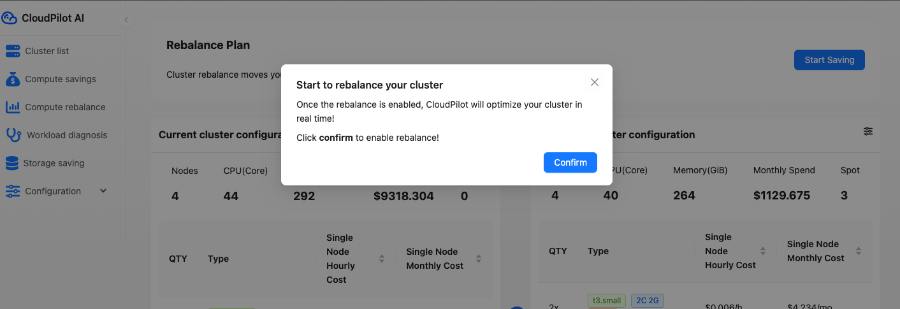
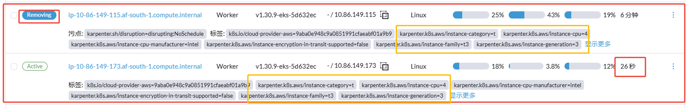

# February 2025 - V1.9.2

✨✨✨ The most recent release brings some urgent new features and bug fixes that should enhance your experience. Check out what's changed:

### 🚀 **Highlights**

#### **Support migrating workloads to be managed by CloudPilot AI one by one**

Some users may want to test the stability of CloudPilot AI by allowing it to manage only parts of the workloads gradually.

Now, CloudPilot AI supports this with the help of the [migration tools](https://github.com/cloudpilot-ai/migrate).

**Steps**:
1. Download the migration tools:
   ```sh
   git clone https://github.com/cloudpilot-ai/migrate.git
   ```

2. Install CloudPilot AI:  
   Refer to the [Quick Start](/guide/getting_started/getting_started) guide. Remember, do not optimize the clusters—only the installation is needed.

3. Migrate the workloads via the command line:
   ```sh
   cd migrate
   # Use ./migrate_linux_amd64 if you're running Linux AMD64
   ./migrate --kubeconfig $KUBECONFIG
   ```
   The following outlines the entire process:
   


After testing the stability, you can go to the console and migrate all the workloads as follows:


In the future, CloudPilot AI will provide this gradual migration ability through our dashboard.

### 🛠️ Bug Fixes
- Fix an issue where a new node of the same type is created, while an old node of the same type, created several minutes earlier, is now being deleted, as shown below:
  
