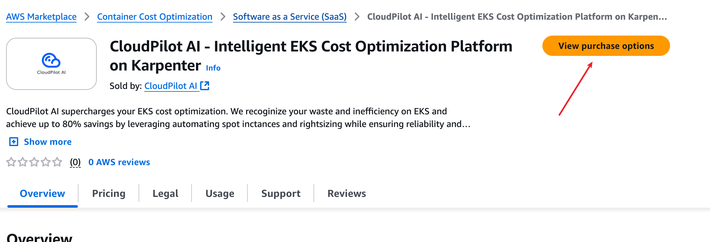
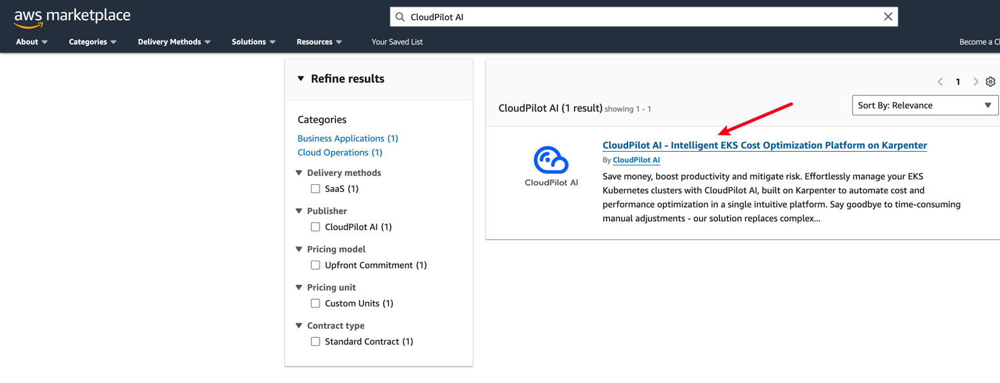

import { Callout } from 'nextra/components'

# AWS Marketplace Subscription for `CloudPilot AI`

This guide shows you how to activate a `CloudPilot AI` subscription through AWS Marketplace so that all management charges for your AWS‑hosted Kubernetes clusters appear on your regular AWS bill.

## Prerequisites

Before you begin, confirm that:

- **AWS account access** – Your AWS Identity has permission to subscribe to Marketplace products (for example, the managed policy **AWSMarketplaceManageSubscriptions**).
- **CloudPilot AI account** – You can sign in to the `CloudPilot AI` console, or you are ready to create a new account during the linking step.

## Step 1: Find the `CloudPilot AI` in AWS Marketplace

1. Sign in to the AWS **Management Console**.
2. Either follow the direct link below or search **CloudPilot AI** in **[AWS Marketplace](https://aws.amazon.com/marketplace)**.

[CloudPilot AI in AWS Marketplace](https://aws.amazon.com/marketplace/pp/prodview-njy5lk7ivnckm)

## Step 2: Choose a subscription plan

1. On the product listing page, choose **View purchase options**.
2. Select the pricing plan that matches your expected cluster size, and (optionally) enable **Auto‑renewal**.
3. Choose **Subscribe** (or **Continue to Subscribe**) and confirm in the popup dialog.

## Step 3: Link your `CloudPilot AI` account

After the transaction completes, a **Set-up your account** button appears on the listing.

Click **Set up your account** to open the `CloudPilot AI` console.

- If you are already signed in, `CloudPilot AI` automatically links the subscription to your account.
- Otherwise, sign in or register, and `CloudPilot AI` completes the link once authentication finishes.

<Callout type="info">
    You can review `CloudPilot AI` usage at any time in **[AWS Billing](https://us-east-1.console.aws.amazon.com/billing/home#/bills)**.

    `CloudPilot AI` reports the average vCPU count across the nodes it manages to AWS Marketplace every hour to calculate your bill.
</Callout>
