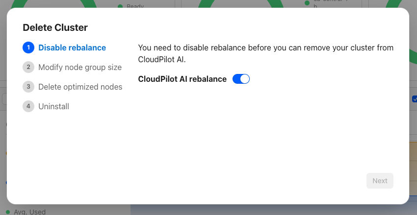
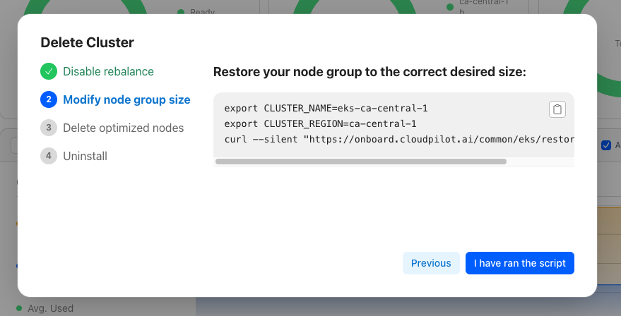
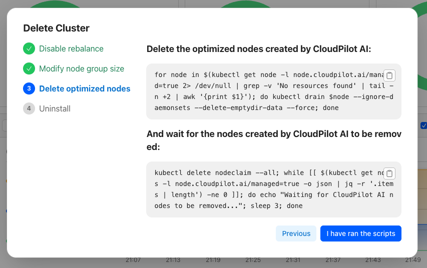
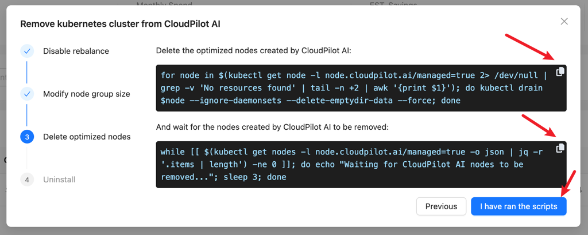

import { Callout } from 'nextra/components'

# Uninstalling CloudPilot AI

This guide outlines the safe and smooth removal of CloudPilot AI components from your cluster. The steps detailed here are provider-agnostic and applicable to any Kubernetes cluster.

## Prerequisites

Before starting the uninstallation, ensure:
- You have administrative access to the Kubernetes cluster.
- A compatible node group or node pool is prepared and ready to accommodate your workloads.
- PodDisruptionBudgets (PDB) are correctly configured if your cluster has strict stability requirements.

## Step 1: Remove Cluster from CloudPilot AI Management

On the cluster list page, click `Remove` for the cluster you intend to detach from CloudPilot AI. Verify carefully before proceeding to avoid unintended cluster removal.

Before initiating removal, ensure your alternative node groups or pools are correctly configured to allow rollback if needed.



## Step 2: Disable Rebalancing

As a preliminary step, disable the Rebalance feature to prevent potential rollback failures.

<Callout type="info">
    Disabling Rebalance will stop CloudPilot AI from provisioning new nodes and managing Spot interruptions. In the event of Spot interruptions, manual intervention will be required to mitigate unexpected behavior.
</Callout>



## Step 3: Restore Original Node Groups or Pools

Restore the original configurations of your node groups or pools to ensure workloads can migrate back seamlessly.

<Callout type="info">
    If misconfiguration during this step impedes pod migration, you can safely repeat this step independently of CloudPilot AI functionalities.
</Callout>



## Step 4: Evict Pods from CloudPilot AI Managed Nodes

Evict all pods currently running on nodes managed by CloudPilot AI. This step migrates pods back to your original node groups or pools. Be cautious as pod disruptions will occur.

<Callout type="warning">
    If your cluster requires high stability, ensure appropriate PodDisruptionBudgets (PDB) are set prior to execution to maintain cluster stability during pod eviction.
</Callout>



Once eviction is complete, nodes previously managed by CloudPilot AI will be removed from the cluster.

## Step 5: Remove CloudPilot AI Components

After verifying all nodes have been successfully evicted and the cluster remains stable, proceed to remove all CloudPilot AI related components.


## More

### Troubleshooting Improper Uninstallation

During the uninstallation process, you may encounter the following issues if the correct steps are not followed:
- Pod creation failures
- Nodes created by CloudPilot AI remain orphaned (nodes cannot be created or deleted)

This typically occurs when the `cloudpilot` namespace is deleted directly without following the proper uninstallation procedure.

To resolve this issue:

1. **Remove the orphaned webhook configuration:**
   ```bash
   kubectl delete mutatingwebhookconfigurations.admissionregistration.k8s.io cloudpilot-webhook
   ```

2. **Reinstall the CloudPilot agent using the script from the Add Cluster button:**
   ```bash
   export CLOUDPILOT_API_KEY=xxx
   export CLOUD_PROVIDER=aws
   curl --silent "https://onboard.cloudpilot.ai/manifest/v1.10.0/phase1/cloudpilot-agent.yaml" | envsubst | kubectl apply -f -
   ```

3. **Reinstall CloudPilot fully using the Start Saving button script:**
   ```bash
   export CLOUDPILOT_API_KEY=xxx
   export CLOUD_PROVIDER=aws
   export CLUSTER_ID=xxx
   export CLUSTER_NAME=xxx
   export CLUSTER_REGION=us-east-2
   export AWS_PARTITION=aws
   curl --silent "https://onboard.cloudpilot.ai/manifest/v1.10.0/eks/phase2/install.sh" | bash
   ```

4. **Re-run the normal uninstallation process.**

### Uninstall Fails Due to NodeClaim

During uninstallation, the script may fail with the following error:
```bash
Error: nodeclaim exist xxx, please return to the previous step and delete optimized nodes first
```

This usually happens in test clusters with limited capacity — when CloudPilot components are evicted, they can't be rescheduled, causing new nodeclaims to be created repeatedly.

To resolve this:
1. **Expand cluster reserved resources**

    Go back to step 2 and increase the number of available nodes.

2. **Reduce CloudPilot resource usage**

    Reduce the replica count and resource requests to ensure the cluster can handle the load during uninstallation.

    ```bash
    # Reduce the number of replicas
    # aws
    kubectl -n cloudpilot scale deploy cloudpilot-aws-optimizer --replicas 1
    # alibabacloud
    kubectl -n cloudpilot scale deploy cloudpilot-alibabacloud-optimizer --replicas 1
    ```
    ```bash
    # Reduce resource request/limit
    # aws
    kubectl -n cloudpilot patch deploy cloudpilot-aws-optimizer -p '{"spec":{"template":{"spec":{"containers":[{"name":"optimizer","resources":{"requests":{"cpu":"300m","memory":"300Mi"},"limits":{"cpu":"500m","memory":"500Mi"}}}]}}}}'
    # alibabacloud
    kubectl -n cloudpilot patch deploy cloudpilot-alibabacloud-optimizer -p '{"spec":{"template":{"spec":{"containers":[{"name":"optimizer","resources":{"requests":{"cpu":"300m","memory":"300Mi"},"limits":{"cpu":"500m","memory":"500Mi"}}}]}}}}'
    ```

    Then go back to step 3 and continue the uninstall process.


If issues persist, contact CloudPilot Technical Support immediately for assistance.
