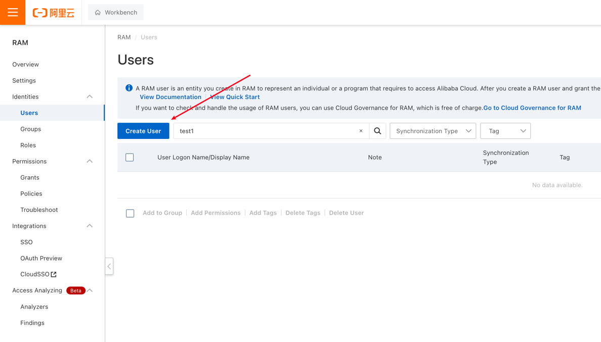
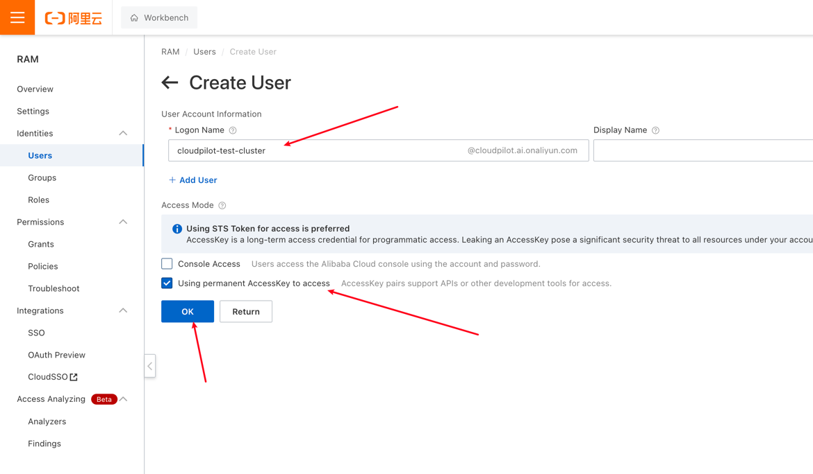
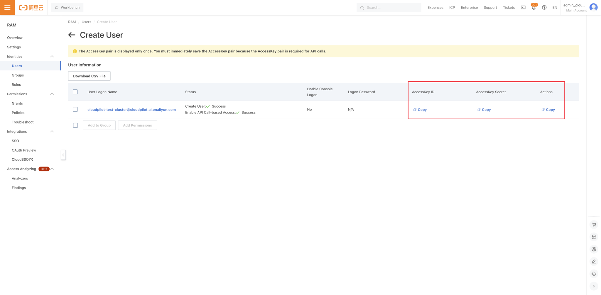
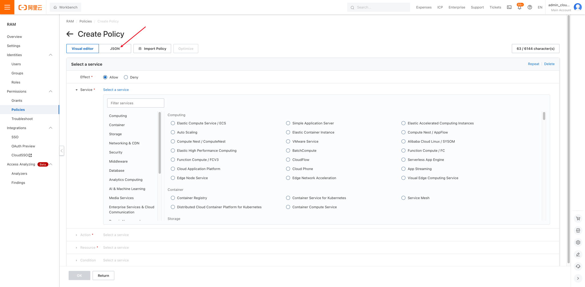
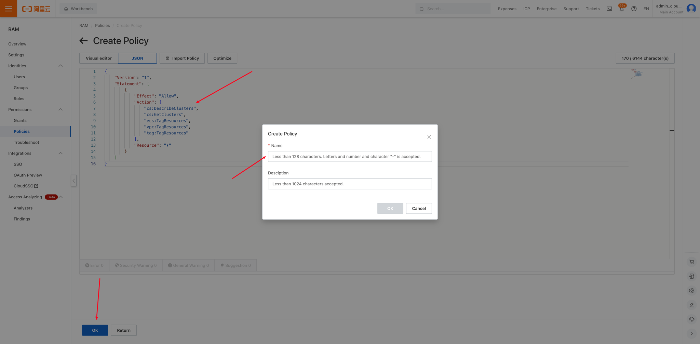

# Deploying CloudPilot AI Using a Sub-User

You can deploy CloudPilot AI using a sub-user by this tutorial.

Currently, the tutorial only supports `AlibabaCloud`.

## AlibabaCloud

### Step 1. Manually Create a AlibabaCloud RAM User

If you want to deploy CloudPilot AI with minimal permissions, you need to manually create the required user and grant the necessary permissions.

Visit this [link](https://ram.console.aliyun.com/users) to create a new RAM User.



Then, create a new RAM User, and your username must follow this format: `cloudpilot-<your cluster name>` (e.g., `cloudpilot-test-cluster`), and you need to check `Using permanent AccessKey to access`.



You must click the following three buttons in order and properly save the copied Access Key and Secret Key.



### Step 2. Add the Required Permissions for the New User

Visit this [page](https://ram.console.aliyun.com/policies) to create Policies.




Please replace the JSON content with the following permission settings:

```json
{
    "Version": "1",
    "Statement": [
        {
            "Effect": "Allow",
            "Action": [
                "cs:DescribeClusters",
                "cs:GetClusters",
                "ecs:TagResources",
                "ecs:UntagResources",
                "vpc:TagResources",
                "vpc:UntagResources",
                "tag:TagResources",
                "tag:UntagResources",
                "ess:ModifyScalingGroup",
                "ram:CreateServiceLinkedRole"
            ],
            "Resource": "*"
        }
    ]
}
```



The name of the Policies should follow this format: `cloudpilot-<your cluster name>-deploy`.

Next, you need to create the required permissions for CloudPilot AI runtime. You can refer to this [article](../security/permissions_required.mdx#privileges-needed-with-alibabacloud) for the JSON content, and the name of this Policy should follow this format: `cloudpilot-<your cluster name>`.

You can use the following command to query your cluster `INTERNAL_CLUSTER_ID`:

```sh
export CLUSTER_NAME=<your cluster name>

INTERNAL_CLUSTER_ID=$(aliyun cs GET /clusters | jq -r --arg CLUSTER_NAME "$CLUSTER_NAME" '.[] | select(.name == $CLUSTER_NAME) | .cluster_id')
echo INTERNAL_CLUSTER_ID: ${INTERNAL_CLUSTER_ID}
```

After creation, visit [this page](https://ram.console.aliyun.com/permissions) to grant the newly created Policies to the new user you just created.


### 3. Log in to Aliyun CLI using the minimal permission user.

Use the AccessKey and SecretKey you just saved to log in to Aliyun CLI, and use this user to deploy CloudPilot AI to your cluster.

```sh
aliyun configure
```

### 4. Deploy CloudPilot AI

Before deploying Phase 2, you must enter the following content to avoid permission issues.

```sh
export SELF_MANAGE_USER=true
export ACCESS_KEY_ID=<your access key>
export ACCESS_KEY_SECRET=<your secret key>
```

Then, follow the steps provided by the Console to install Phase 2.

Note: When uninstalling CloudPilot AI, if you deployed it using this method, you need to enter the following command before uninstallation.

```sh
export SELF_MANAGE_USER=true
```
