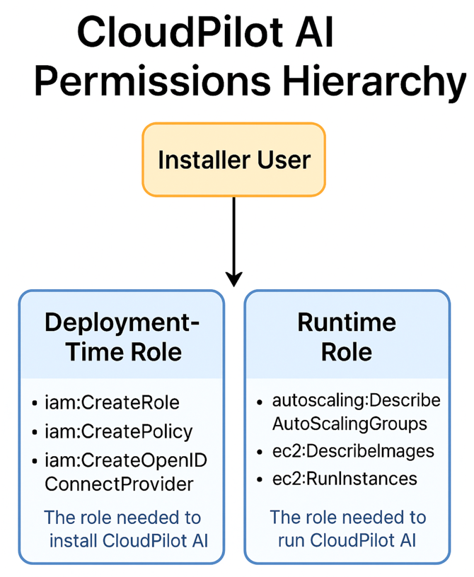
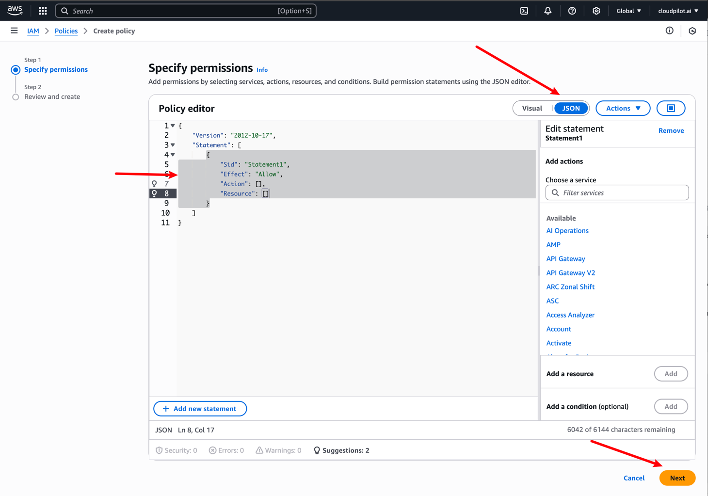
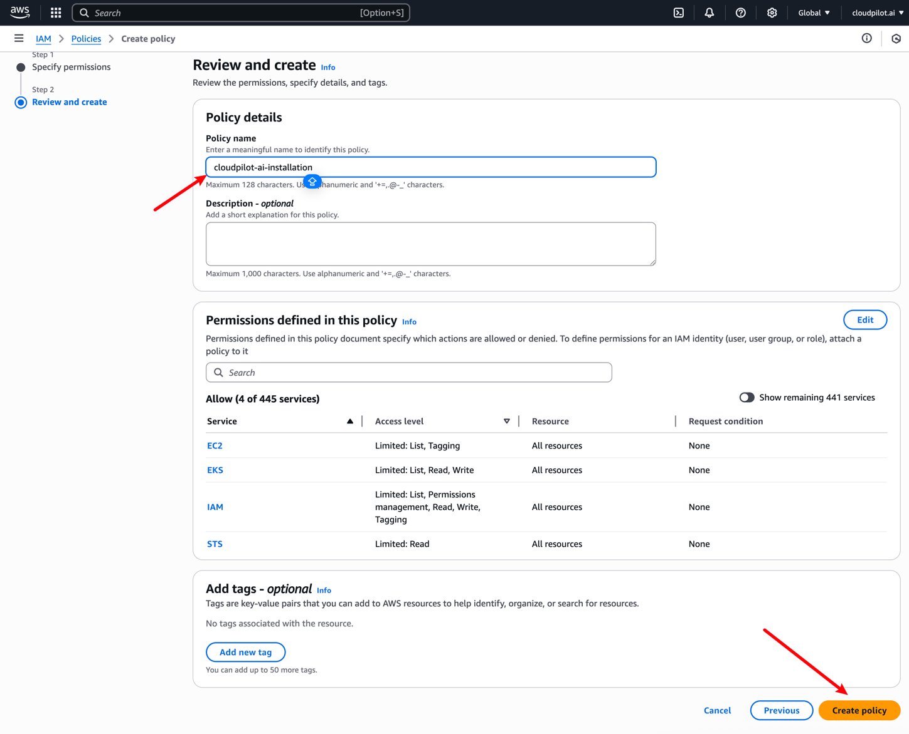
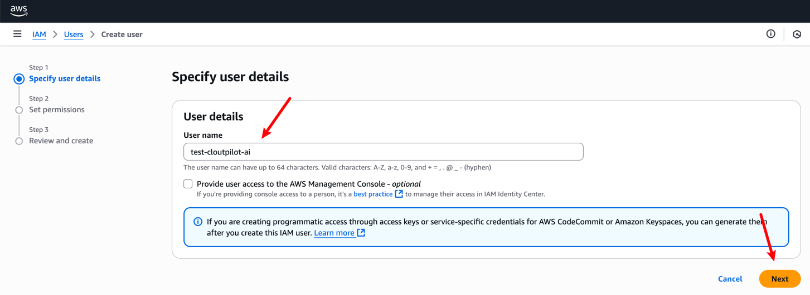
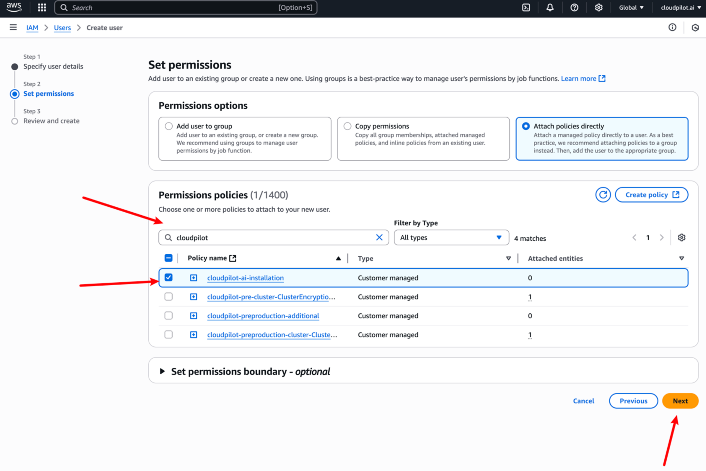
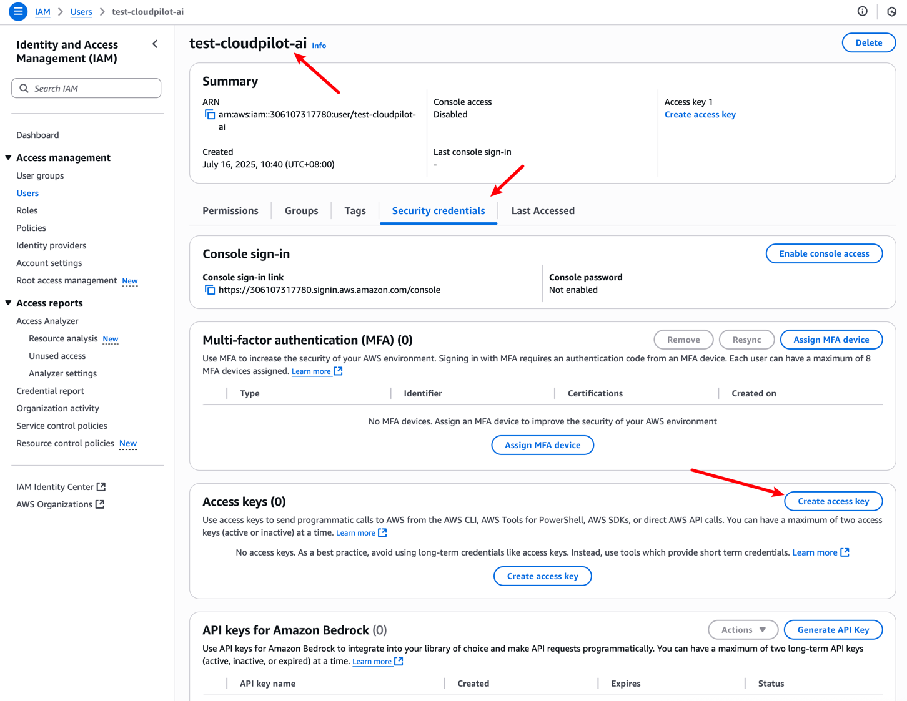
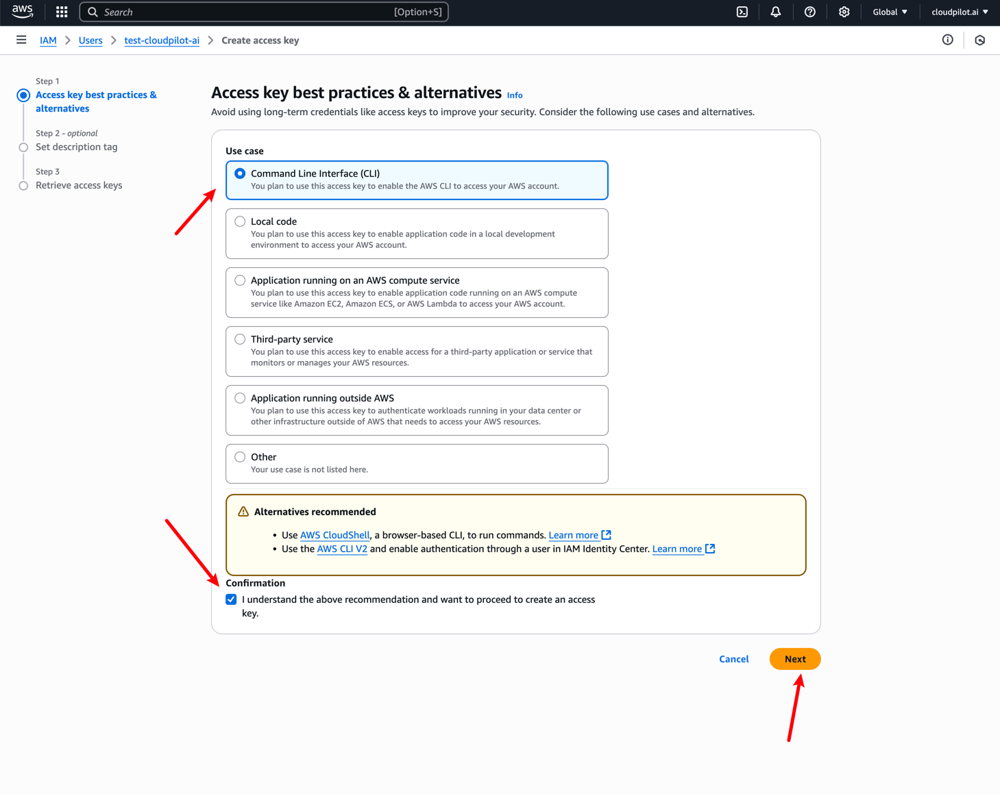
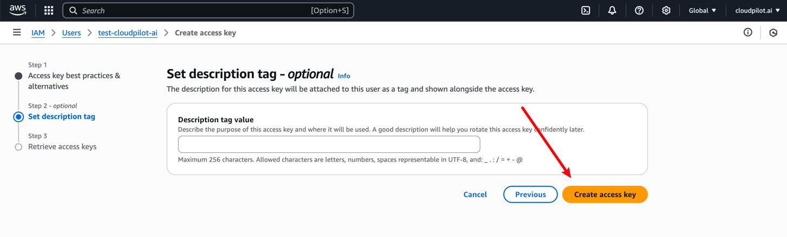
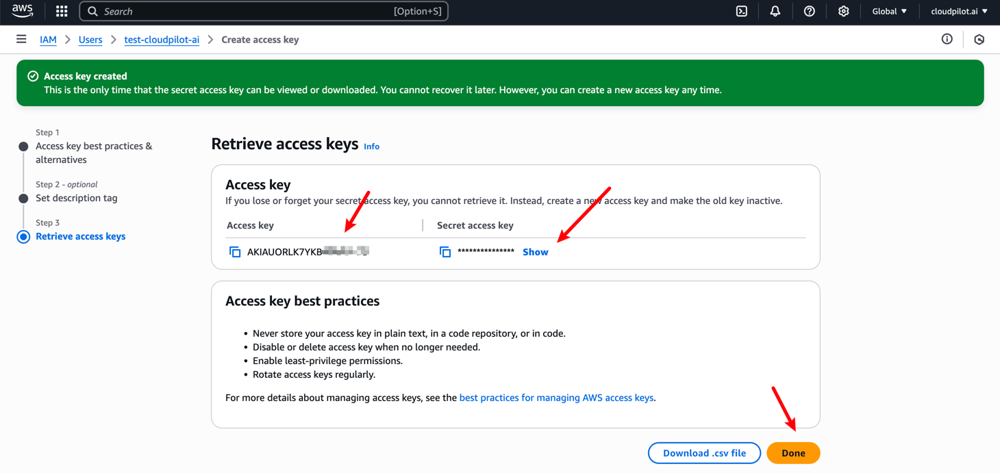
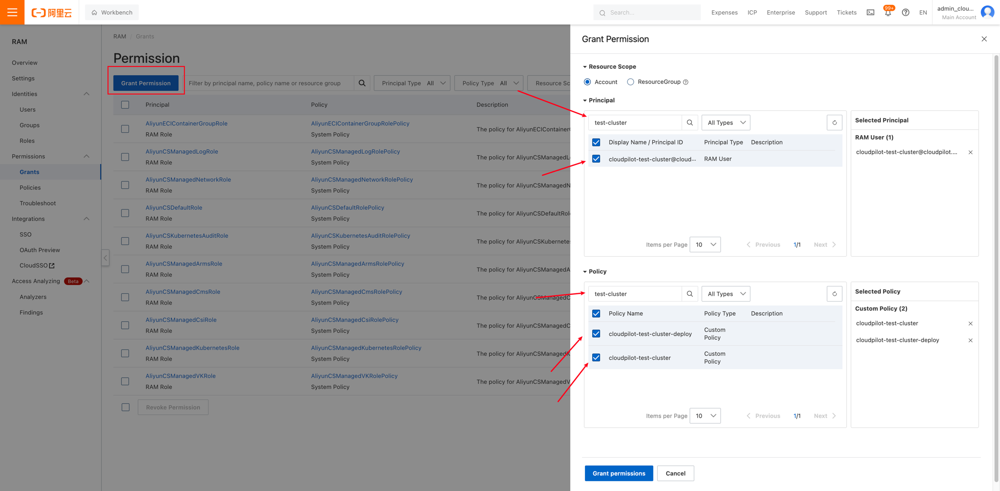

# Deploy CloudPilot AI with an Existing RAM User

This guide explains how to deploy CloudPilot AI using an existing RAM user instead of relying on the default method, which uses local Access Key (AK) and Secret Key (SK) credentials. This approach allows you to follow the principle of least privilege by assigning only the necessary permissions.

Additionally, you can refer to this document to understand the required permissions during deployment. If you have any questions about the permissions, please don't hesitate to contact us. We've categorized the permissions into two types: deployment-time permissions and runtime permissions. After your deployment is complete, ***you can safely remove all deployment-related permissions***.

<div style={{ textAlign: 'center' }}>
  <div style={{ width: '40%', margin: '50px auto 0 auto' }}>
    
  </div>
</div>

## AWS Cloud Provider

### Prerequisites

* An AWS account with IAM access.
* Admin privileges to create and manage IAM users and policies.
* AWS CLI installed and configured on your local machine.
* Access to your target EKS cluster name.

### Step 1: Create the required Policy

You need to create a new IAM Policy on this page: [IAM Policies](https://us-east-1.console.aws.amazon.com/iam/home#/policies).

After selecting `Create Policy`, you'll need to include the following content as the permissions allowed by this policy.

During deployment, we require the following permissions. This documentation will help you ensure that the user associated with your Access Key/Secret Key has been granted these permissions for subsequent deployments. After the deployment is complete, you can safely remove these permissions.

```json
{
  "Version": "2012-10-17",
  "Statement": [
    {
      "Effect": "Allow",
      "Action": [
        "eks:AccessKubernetesApi",
        "eks:DescribeCluster",
        "eks:ListAddons",
        "eks:ListNodegroups",
        "eks:DescribeNodegroup",
        "eks:ListAccessEntries",
        "eks:CreateAccessEntry",

        "sts:GetCallerIdentity",

        "ec2:DescribeInstances",
        "ec2:DescribeTags",
        "ec2:CreateTags",

        "iam:GetRole",
        "iam:CreateRole",
        "iam:UpdateAssumeRolePolicy",
        "iam:AttachRolePolicy",
        "iam:ListAttachedRolePolicies",
        "iam:ListRolePolicies",
        "iam:GetRolePolicy",
        "iam:PutRolePolicy",
        "iam:TagRole",
        "iam:PassRole",
        "iam:ListRoles",
        "iam:PutRolePermissionsBoundary",
        "iam:CreateServiceLinkedRole",

        "iam:GetPolicy",
        "iam:GetPolicyVersion",
        "iam:CreatePolicy",
        "iam:CreatePolicyVersion",
        "iam:ListPolicyVersions",
        "iam:DeletePolicyVersion",
        "iam:ListPolicies",

        "iam:ListOpenIDConnectProviders",
        "iam:CreateOpenIDConnectProvider"
      ],
      "Resource": "*"
    }
  ]
}
```



After clicking `Next`, you need to name this Policy and then complete the creation.



### Step 2: Create an IAM User Manually

You can create a new user on this page: [IAM User](https://us-east-1.console.aws.amazon.com/iam/home?region=us-east-1#/users).



Then, you'll need to attach the previously created Policy to this user.



### Step 3: Create an Access Key for the User

You need to access the IAM User page, locate the user you just created, and create an Access Key for it.







Finally, you must manually and securely save both the **Access Key** and **Secret Access Key**, as they will be required for subsequent deployments.



### Step 4: Kubernetes Access Permissions

You need to ensure that your new AWS user has sufficient permissions to perform relevant operations on your cluster. If you haven't configured specific cluster permissions for this user, you can follow these steps:

We'll need to use an administrator account to create an Access Entry with a custom group name, then create a ClusterRoleBinding (CRB) to associate this group with admin permissions for your specific cluster. This will grant your AWS user admin privileges for the cluster.

```sh
# Remember to set these environment variables before running the commands
# Replace with your actual values for cluster-name and user-arn
export CLUSTER_NAME=<cluster-name> # Your EKS cluster name
export USER_ARN=<user-arn>         # The ARN of your new AWS user/role
export GROUP_NAME=eks-admins       # Default group name (can be changed)
export CLUSTER_ROLE=cluster-admin  # Default cluster role (can be changed)
export REGION=us-east-1            # Default AWS region (can be changed)

# Create access entry in EKS
aws eks create-access-entry \
--cluster-name ${CLUSTER_NAME} \
--principal-arn ${USER_ARN} \
--type STANDARD \
--kubernetes-groups ${GROUP_NAME} \
--region ${REGION}

# Ensure your KubeConfig is properly configured before running this
kubectl create clusterrolebinding ${GROUP_NAME}-crb \
--clusterrole ${CLUSTER_ROLE} \
--group ${GROUP_NAME}
```

### Step 5: Configure AWS CLI

Use the Access Key and Secret Access Key from the new IAM user:

```sh
aws configure
```

Input the Access Key, Secret Access Key, and default region when prompted.

Then, you can proceed with the normal deployment steps to deploy `CloudPilot AI` using this AWS user.

## AlibabaCloud Provider

### Prerequisites

* An Alibaba Cloud account with RAM access.
* Admin privileges to create and manage RAM users and policies.
* Aliyun CLI installed and configured on your local machine.
* Access to your target ACK cluster name.

### Step 1: Create a RAM User Manually

Navigate to the [RAM User Console](https://ram.console.aliyun.com/users) and create a new RAM user.

* **Username Format:** `cloudpilot-<your cluster name>` (e.g., `cloudpilot-test-cluster`)
* **Access Type:** Enable “Programmatic Access” with a permanent AccessKey.

Save the generated Access Key ID and Secret Key securely.

### Step 2: Attach Required Permissions

Navigate to the [Policy Management Console](https://ram.console.aliyun.com/policies) and create two policies:

#### a. Deployment Policy

Create a policy named `cloudpilot-<your cluster name>-deploy` with the following JSON:

```json
{
    "Version": "1",
    "Statement": [
        {
            "Effect": "Allow",
            "Action": [
                "cs:DescribeClusters",
                "cs:GetClusters",
                "ecs:TagResources",
                "ecs:UntagResources",
                "vpc:TagResources",
                "vpc:UntagResources",
                "tag:TagResources",
                "tag:UntagResources",
                "ess:ModifyScalingGroup"
            ],
            "Resource": "*"
        }
    ]
}
```

#### b. Runtime Policy

Refer to the [permissions reference](../security/permissions_required.mdx#privileges-needed-with-alibabacloud) and create a policy named `cloudpilot-<your cluster name>`.

#### Granting Permissions

Go to the [Permissions Console](https://ram.console.aliyun.com/permissions) and assign both policies to the newly created RAM user.

To retrieve your `INTERNAL_CLUSTER_ID`, use:

```sh
export CLUSTER_NAME=<your cluster name>

INTERNAL_CLUSTER_ID=$(aliyun cs GET /clusters | jq -r --arg CLUSTER_NAME "$CLUSTER_NAME" '.[] | select(.name == $CLUSTER_NAME) | .cluster_id')
echo INTERNAL_CLUSTER_ID: ${INTERNAL_CLUSTER_ID}
```

After creation, visit [this page](https://ram.console.aliyun.com/permissions) to grant the newly created Policies to the new user you just created.




### Step 3: Configure Aliyun CLI

Use the Access Key ID and Secret Key from the new RAM user:

```sh
aliyun configure
```

Input the Access Key ID, Secret Key, and default region when prompted.

### Step 4: Deploy CloudPilot AI

Set environment variables to indicate that you're managing credentials manually:

```sh
export SELF_MANAGE_USER=true
export ACCESS_KEY_ID=<your access key>
export ACCESS_KEY_SECRET=<your secret key>
```

Proceed with Phase 2 installation as directed by the CloudPilot AI Console.

### More

> **Note:** If you uninstall CloudPilot AI later, make sure to set the `SELF_MANAGE_USER` flag again to avoid permission issues:

```sh
export SELF_MANAGE_USER=true
```