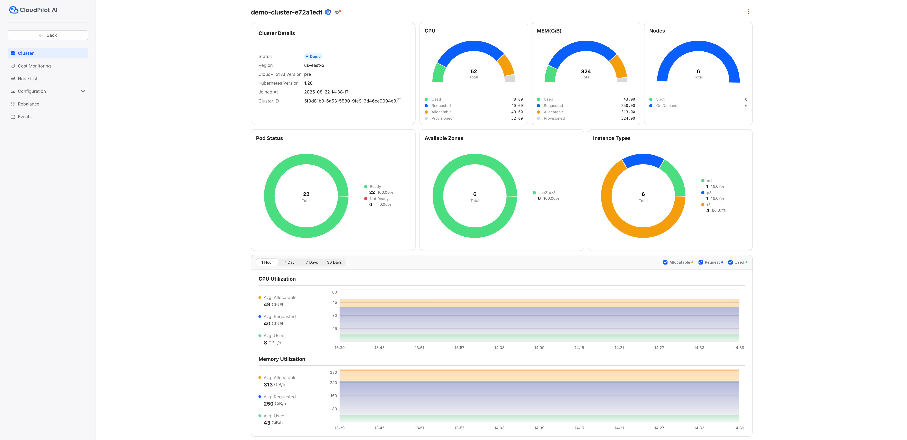
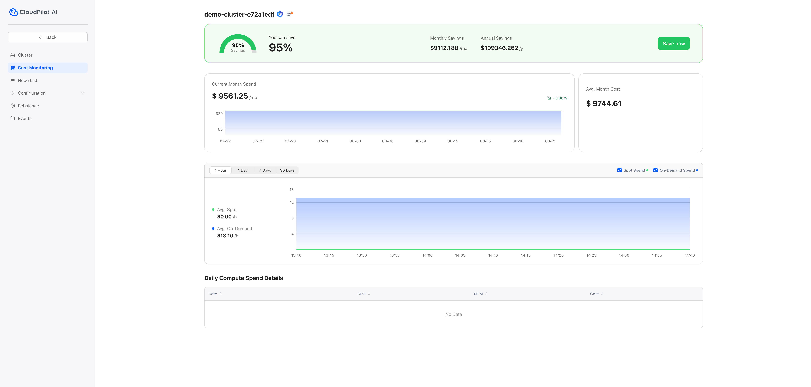

# Quickstart

This document provides a step-by-step guide to deploying and optimize a cluster with CloudPilot AI. It covers cluster creation, connection to the CloudPilot AI console, installation of optimization components, and cluster rebalancing.

## Prerequisites

- An AWS account with appropriate permissions to create and manage EKS clusters.
- `kubectl`, `awscli`, and `eksctl` installed and configured on your local machine.
- Access to the [CloudPilot AI console](https://console.cloudpilot.ai).

## Step 1: Create an EKS Cluster

Currently, **CloudPilot AI** supports only EKS (AWS) and ACK (Alibaba Cloud) clusters. Support for additional cloud providers will be added in the future. If you already have a compatible cluster, skip this step.

To quickly set up an EKS cluster, follow the instructions in the [Demostration Cluster for CloudPilot AI](https://github.com/cloudpilot-ai/examples/tree/main/clusters/eks-ondemand).

## Step 2: Connect Your Cluster to CloudPilot AI

After logging into the [CloudPilot AI console](https://console.cloudpilot.ai), perform the following:

1. Click **Add Cluster**.
2. Copy and execute the provided shell command in your terminal.

  

    
  

  

    
  

After executing the script:

1. Click **I ran the script**.

2. Click the selected cluster, navigate to the **Cluster** and **Cost Monitoring** tab, and view the potential savings.

  

    
  

  

    
  

## Step 3: Install CloudPilot AI Optimization Components

Once your cluster is connected, proceed to install the optimization components:

1. Run the provided shell script in your environment.
2. After successful execution, click **I ran the script**.

You will be redirected to the **Rebalance** page.

  

## Step 4: Rebalance Your Cluster

To optimize your cluster, initiate the rebalance process. This consists of three steps:

1. Launch new replacement nodes.
2. Drain workloads from old nodes to the new ones.
3. Terminate the old nodes safely after draining.

This ensures zero-downtime workload migration while optimizing resource usage.

  

Once completed, your cluster will be under CloudPilot AI management. It will automatically scale out during workload surges and scale in during low usage, always selecting the most suitable node types for your workloads.
