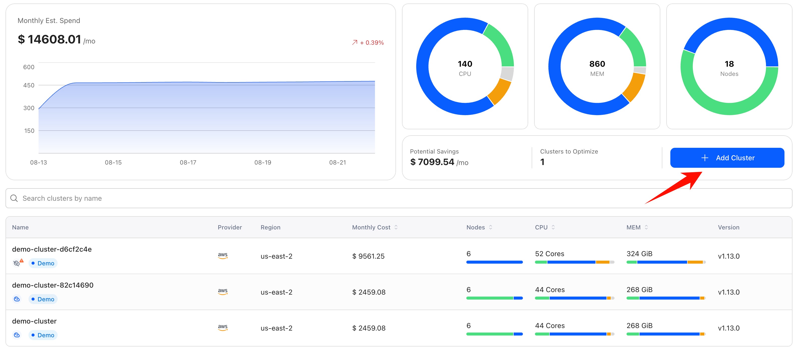
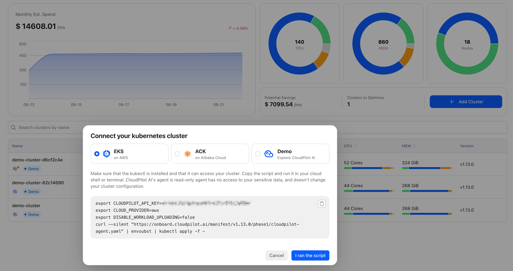
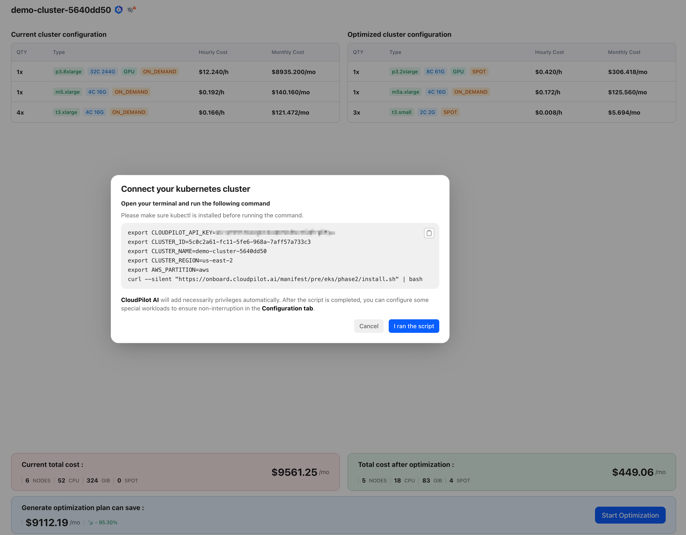
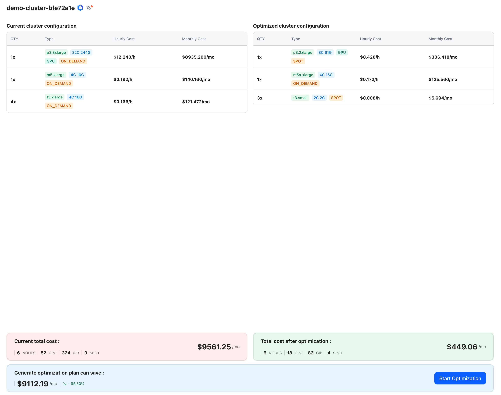
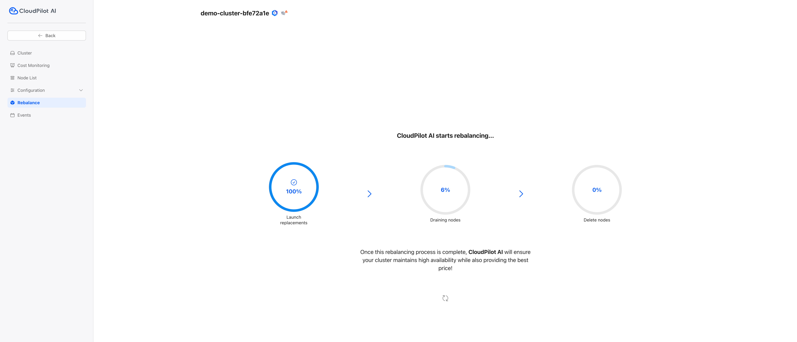

# Quickstart

### Step 1. Create a EKS cluster

Now, **CloudPilot AI** only supports EKS clusters, other cloud providers will be supported soon. If you already have a cluster, please skip this step.

You can refer to the doc [Demostration Cluster for CloudPilot AI](https://github.com/cloudpilot-ai/examples/tree/main/clusters/eks-ondemand) to create an EKS cluster easily.

### Step 2. Connect a Cluster to CloudPilot AI

After logging in to [CloudPilot AI console](https://console.cloudpilot.ai), click on `Add Cluster` and execute the provided shell script in your terminal.

Once the shell script has run, click the `I ran the script` button. You will then see your potential savings with CloudPilot AI in the `Cost overview`.

### Step 3. Install CloudPilot AI Optimization Components

After connecting your cluster to CloudPilot AI, you can begin installing the optimization components by executing the provided shell script.

Once the shell script has run, click the `I ran the script` button. You will be redirected to the rebalance page.

### Step 4. Rebalance your cluster

Now, you can start rebalancing your clusters. This process will be done in three steps:
1. Launch the new replacement nodes.
2. Drain the workloads from the old nodes to the new nodes.
3. Delete the old nodes.

This process ensures that your workloads are always available.

With these steps, your cluster is now managed by CloudPilot AI. It will scale out when your workloads increase and scale in when your workloads decrease, always choosing the nodes that best match your workloads.
