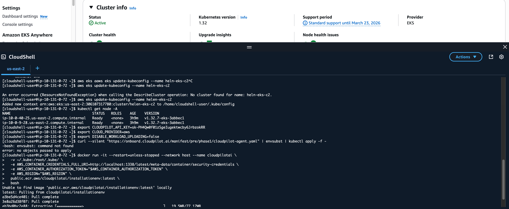

# Prepare the Operation Environment

This guide helps you set up an operation environment to install/upgrade CloudPilot AI.

## Prerequisites

* Cloud provider account credentials (Access Key/Secret Key)
* Docker or Kubernetes access
* Basic familiarity with command-line operations

## Step 1: Launch the Container Environment

### Option 1: Docker Environment

Launch a container with all required tools pre-installed:

```bash
docker run -it --restart=unless-stopped --name cloudpilotai \
  public.ecr.aws/cloudpilotai/installationenv:latest \
  bash
```

### Option 2: Kubernetes Pod

For environments without Docker:

```bash
kubectl run helper --image=public.ecr.aws/cloudpilotai/installationenv:latest \
  -it --rm --restart=Never -- /bin/bash
```

## Step 2: Configure Cloud Provider Credentials

### AWS Configuration

Configure AWS credentials:

```bash
aws configure
```

Provide your credentials when prompted:
```
AWS Access Key ID: <your_access_key>
AWS Secret Access Key: <your_secret_key>
Default region name: us-east-2
Default output format: json
```

Update kubeconfig for EKS:

```bash
mkdir -p ~/.kube
export KUBECONFIG=~/.kube/config
aws eks update-kubeconfig --name <cluster_name> --region us-east-2
```

**Verify setup:**
```bash
aws sts get-caller-identity
kubectl get nodes
```

### Alibaba Cloud Configuration

Configure Alibaba Cloud credentials:

```bash
aliyun configure
```

Follow the prompts:
```
Access Key ID: <your_access_key>
Access Key Secret: <your_secret_key>
Default Region ID: cn-shenzhen
Default Output Format: json
Default Language: en
```

Setup kubeconfig for ACK:

```bash
mkdir -p ~/.kube
export KUBECONFIG=~/.kube/config
export CLUSTER_NAME=<cluster_name>
export CLUSTER_ID=$(aliyun cs GET /clusters | jq -r --arg CLUSTER_NAME "$CLUSTER_NAME" '.[] | select(.name == $CLUSTER_NAME) | .cluster_id')
aliyun cs GET /k8s/$CLUSTER_ID/user_config | jq -r '.config' > $KUBECONFIG
```

**Verify setup:**
```bash
kubectl get nodes
```

## Alternative Setup Using AWS CloudShell

If you don't have access to a terminal environment for AWS clusters, you can use AWS CloudShell to launch the operational environment. Execute the following command to set up your containerized workspace:
```sh
docker run -it --restart=unless-stopped --network host --name cloudpilotai \
  -v ~/.kube:/root/.kube/ \
  -e AWS_CONTAINER_CREDENTIALS_FULL_URI=http://localhost:1338/latest/meta-data/container/security-credentials \
  -e AWS_CONTAINER_AUTHORIZATION_TOKEN="$AWS_CONTAINER_AUTHORIZATION_TOKEN" \
  -e AWS_REGION="$AWS_REGION" \
  public.ecr.aws/cloudpilotai/installationenv:latest \
  bash
```

It will look like:


**Verify setup:**
```bash
kubectl get nodes
```

## Next Steps

Your environment is now configured and ready for CloudPilot AI installation or upgrade operations.
