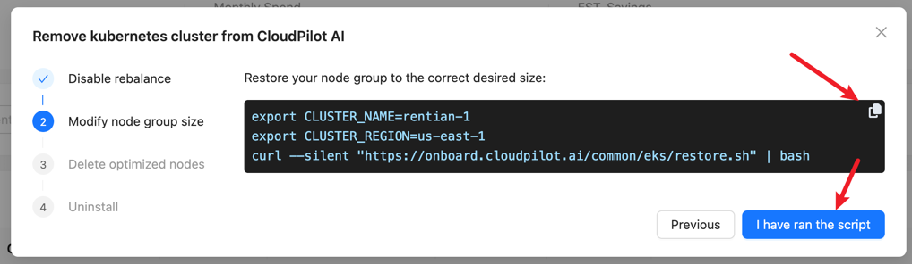
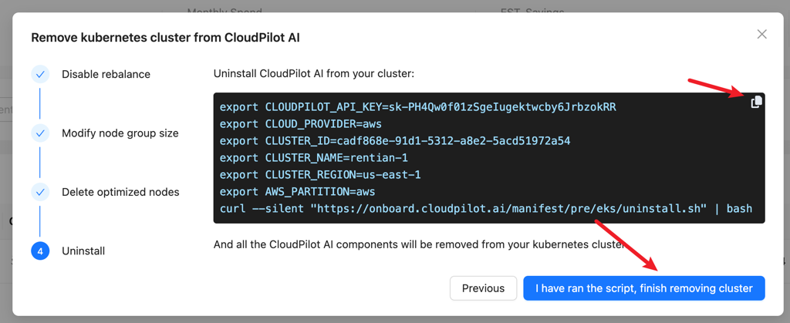

import { Callout } from 'nextra/components'

# Uninstalling CloudPilot AI

This guide outlines the safe and smooth removal of CloudPilot AI components from your cluster. The steps detailed here are provider-agnostic and applicable to any Kubernetes cluster.

## Prerequisites

Before starting the uninstallation, ensure:
- You have administrative access to the Kubernetes cluster.
- A compatible node group or node pool is prepared and ready to accommodate your workloads.
- PodDisruptionBudgets (PDB) are correctly configured if your cluster has strict stability requirements.

## Step 1: Remove Cluster from CloudPilot AI Management

On the cluster list page, click `Remove` for the cluster you intend to detach from CloudPilot AI. Verify carefully before proceeding to avoid unintended cluster removal.

Before initiating removal, ensure your alternative node groups or pools are correctly configured to allow rollback if needed.

## Step 2: Disable Rebalancing

As a preliminary step, disable the Rebalance feature to prevent potential rollback failures.

<Callout type="info">
    Disabling Rebalance will stop CloudPilot AI from provisioning new nodes and managing Spot interruptions. In the event of Spot interruptions, manual intervention will be required to mitigate unexpected behavior.
</Callout>

## Step 3: Restore Original Node Groups or Pools

Restore the original configurations of your node groups or pools to ensure workloads can migrate back seamlessly.

<Callout type="info">
    If misconfiguration during this step impedes pod migration, you can safely repeat this step independently of CloudPilot AI functionalities.
</Callout>

## Step 4: Evict Pods from CloudPilot AI Managed Nodes

Evict all pods currently running on nodes managed by CloudPilot AI. This step migrates pods back to your original node groups or pools. Be cautious as pod disruptions will occur.

<Callout type="warning">
    If your cluster requires high stability, ensure appropriate PodDisruptionBudgets (PDB) are set prior to execution to maintain cluster stability during pod eviction.
</Callout>

Once eviction is complete, nodes previously managed by CloudPilot AI will be removed from the cluster.

## Step 5: Remove CloudPilot AI Components

After verifying all nodes have been successfully evicted and the cluster remains stable, proceed to remove all CloudPilot AI related components.

