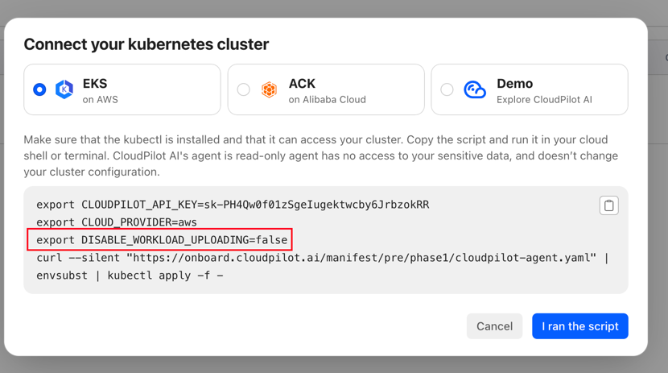

# Disable Workload Uploading

If you require a high level of confidentiality for your cluster information and do not permit transmitting details such as Namespace and Workload Name to CloudPilot AI, you can disable workload information uploading by following the steps outlined in this document.

## Disable when installing CloudPilot AI

You must disable this capability when deploying CloudPilot AI; otherwise, by default, workload information will be automatically uploaded to CloudPilot AI.

When deploying Phase 1, you need to manually set the `DISABLE_WORKLOAD_UPLOADING` environment variable to `true`:



Later, when deploying Phase 2, make sure to set the `DISABLE_WORKLOAD_UPLOADING` environment variable to `true` before starting the deployment.

```sh
export DISABLE_WORKLOAD_UPLOADING=true
```

## Workload Configuration

Once workload information uploading is disabled, you will no longer be able to use the features provided on the `Workload Configuration` page, such as setting `Spot Friendly`, `Min Non-Spot Replicas`, or `Rebalanceable` for workloads.

However, you can still configure these settings using labels and annotations.

For more details on the available configuration options, please refer to the [Workload Configuration Guide](./workload_config.mdx).

### Rebalanceable Configuration

If you want a specific workload to be completely unaffected by CloudPilot AI, you can add the following annotation to the target workload:

```yaml
karpenter.sh/do-not-disrupt: "true"
```

### Spot Friendly Configuration

If you don’t want a specific workload to be scheduled onto Spot instances, you can add the following label to the target workload:

```yaml
workload.cloudpilot.ai/spot-friendly: "false"
```

### Min Non-Spot Replicas Configuration

If you want to ensure that at least X replicas of a workload are scheduled onto non-Spot instances, you can add the following label to the target workload:

```yaml
workload.cloudpilot.ai/min-nonspot: "2"
```

## Dashboard

When workload information uploading is disabled, you will still be able to view aggregated workload data; however, detailed information for individual workloads will no longer be available.

We will continue to upload the UID of the workload and namespace (instead of their actual names) to CloudPilot AI, so that you can still see the overall workload status summary.

## Optimize Simulation

When workload information uploading is disabled, you can still customize the scheduling behavior of specific workloads using labels or annotations. This allows you to view simulated scheduling results during Phase 1 based on those custom configurations.
