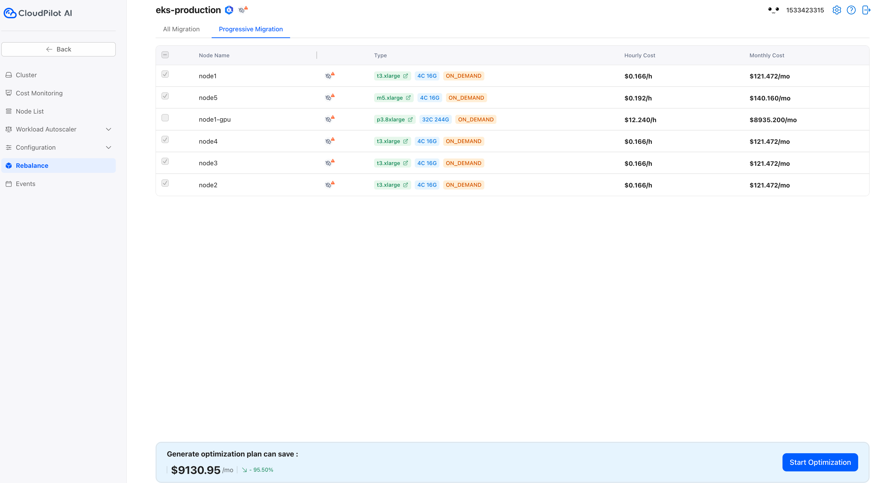

import { Callout } from 'nextra/components'

# Gradual Cluster Optimization

In some scenarios, users may want to keep certain nodes:
- Optimize a few nodes in the cluster first to check for stability and cost savings before optimizing all of them.
- Some nodes are on an annual or monthly subscription, and they have not yet expired. These nodes should be kept until their subscription ends.
- Some nodes are Reserved Instances (RI) or Savings Plan (SP), and the contract has not yet expired. These should also be kept until their contract ends.

<Callout type="info">
- **Reserved Instances (RI)**: Prepaid instances with significant discounts for a 1- or 3-year commitment to a specific instance type and region.  

- **Savings Plan**: A flexible commitment-based discount model that applies to various instance types and regions over 1 or 3 years.
</Callout>

By following the steps below, you can selectively optimize only a part of the nodes.

## Install CloudPilot AI

Before proceeding, please install CloudPilot AI by following the instructions in the [Quickstart guide](/guide/getting_started/getting_started). However, remember to only execute the first three steps.

## Rebalance target nodes

Go to the rebalance page, click `Progressive Migration`, and select the nodes you want to optimize. The unselected nodes will remain unchanged. Follow these steps:

  

## Start Cluster Optimization

Now, click the `Start Optimization` button. CloudPilot AI will optimize only the selected nodes. In the end, you'll see that only the unselected nodes remain unchanged.