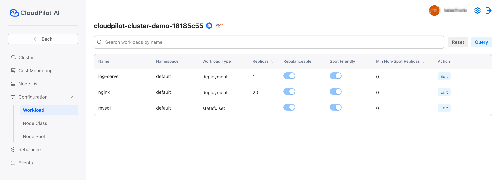
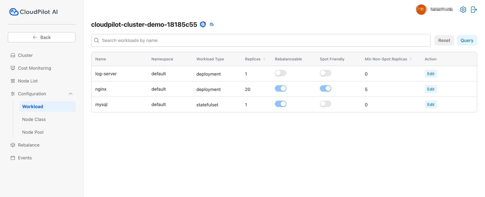

# Workload Configuration Guide

## 1. Configuration Overview

The **Workload Configuration** allows you to customize various settings for workloads within your system to optimize performance, cost-efficiency, and reliability. The key configuration options are:

### Rebalanceable Configuration
This setting determines whether a workload can be part of a **Rebalance** operation, meaning it can be moved or adjusted by the system as part of resource optimization. Enabling this option allows your workload to be managed and rebalanced by the system for better resource allocation.

### Spot Friendly Configuration
This option specifies whether a workload is compatible with cloudpilot ai's **Spot Scheduling**, which allows workloads to run on spot instances that are often cheaper but may be terminated by the cloud provider with little notice. This configuration takes effect only if **Rebalanceable** is enabled.

### Min Non-Spot Replicas Configuration
This configuration sets the minimum number of **Non Spot Replicas** required for the workload. It ensures that even when spot instances are used, a certain number of replicas remain on more stable, non-spot instances. This setting is only relevant when the **Spot Friendly** configuration is enabled.

## 2. Personalized Workload Configuration

Here’s an example of how to configure different workloads with the settings mentioned above:

1. Set the **log-server** workload to **Non Rebalanceable**, ensuring it is not included in any rebalance operations.
2. Enable **Rebalanceable** for the **nginx** workload, and set its **Min Non-Spot Replicas** to **5**, ensuring there are at least 5 non-spot replicas for nginx at all times.
3. Set **mysql** to be **Rebalanceable** and **Non Spot Friendly**, allowing it to be scheduled on spot instances as needed.

### Example Configuration:
- **log-server**: Non Rebalanceable
- **nginx**: Rebalanceable, Min Non-Spot Replicas = 5
- **mysql**: Rebalanceable, Non Spot Friendly

## 3. Rebalance Effect

Once CloudPilot AI takes over the cluster, you will see that additional **On-Demand** instances have been provisioned for **mysql** and **nginx**, ensuring that 5 non-spot replicas for nginx and the stability of the **mysql** workload are maintained.

This configuration provides the following benefits:
- Optimized cost efficiency by utilizing spot instances where possible.
- Reliable performance by ensuring critical workloads (like **mysql**) are run on stable, non-spot instances.
- Increased flexibility in resource allocation as the system dynamically adjusts the workloads through the **Rebalance** feature.

With these configurations, CloudPilot AI will automatically manage and adjust your workloads for optimal performance, cost savings, and reliability.