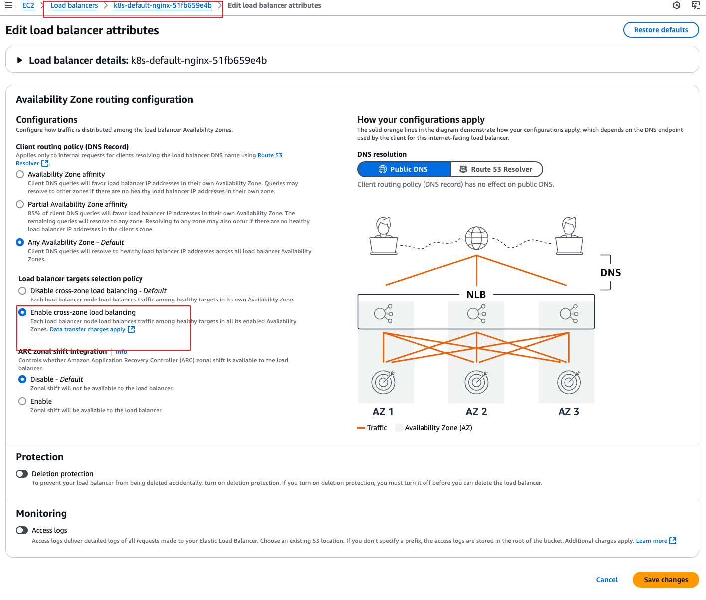

# Ensure Accessibility of AWS EKS Load Balancer Service

When using AWS EKS Load Balancer Service, if the replicas of a workload are few, you may encounter accessibility issues from time to time.

### Example (AWS Load Balancer Controller should be installed):
```yaml
apiVersion: apps/v1
kind: Deployment
metadata:
  name: nginx
  labels:
    app: nginx
spec:
  replicas: 1
  selector:
    matchLabels:
      app: nginx
  template:
    metadata:
      labels:
        app: nginx
    spec:
      containers:
      - name: nginx
        image: nginx:latest
        ports:
          - containerPort: 80
            protocol: TCP
            name: http
---
apiVersion: v1
kind: Service
metadata:
  name: nginx
  annotations:
    service.beta.kubernetes.io/aws-load-balancer-type: "external"
    service.beta.kubernetes.io/aws-load-balancer-nlb-target-type: "ip"
    service.beta.kubernetes.io/aws-load-balancer-scheme: "internet-facing"
spec:
  selector:
    app: nginx
  ports:
    - protocol: TCP
      port: 80
      targetPort: 80
      name: http
  type: LoadBalancer
```

After applying the YAML file, you will get the corresponding public URL:

```bash
$ kubectl get svc 
NAME                  TYPE           CLUSTER-IP     EXTERNAL-IP                                                                 PORT(S)        AGE
nginx                 LoadBalancer   172.20.75.38   k8s-default-nginx-51fb659e4b-8a5f5dd1910f981f.elb.us-east-2.amazonaws.com   80:32358/TCP   2m4s
```

When you try to check the IP address:

```bash
$ nslookup k8s-default-nginx-51fb659e4b-8a5f5dd1910f981f.elb.us-east-2.amazonaws.com
Server:         192.168.31.1
Address:        192.168.31.1#53

Non-authoritative answer:
Name:   k8s-default-nginx-51fb659e4b-8a5f5dd1910f981f.elb.us-east-2.amazonaws.com
Address: 3.18.27.194
Name:   k8s-default-nginx-51fb659e4b-8a5f5dd1910f981f.elb.us-east-2.amazonaws.com
Address: 3.134.136.77
Name:   k8s-default-nginx-51fb659e4b-8a5f5dd1910f981f.elb.us-east-2.amazonaws.com
Address: 3.128.225.234
```

When testing accessibility with all the IP addresses:

```bash
$ curl -H "Host: k8s-default-nginx-51fb659e4b-8a5f5dd1910f981f.elb.us-east-2.amazonaws.com" 3.134.136.77
timeout ^C
$ curl -H "Host: k8s-default-nginx-51fb659e4b-8a5f5dd1910f981f.elb.us-east-2.amazonaws.com" 3.128.225.234
timeout ^C
$ curl -H "Host: k8s-default-nginx-51fb659e4b-8a5f5dd1910f981f.elb.us-east-2.amazonaws.com" 3.18.27.194 
...Thank you for using nginx.</em></p>...
```

In this case, only one IP works. To ensure the availability of the service, you need to enable the **Cross-Zone Load Balancing** feature:



Now, if you curl any of the IPs, they will all work perfectly:

```bash
$ curl -H "Host: k8s-default-nginx-51fb659e4b-8a5f5dd1910f981f.elb.us-east-2.amazonaws.com" 3.134.136.77
...Thank you for using nginx.</em></p>...

$ curl -H "Host: k8s-default-nginx-51fb659e4b-8a5f5dd1910f981f.elb.us-east-2.amazonaws.com" 3.128.225.234
...Thank you for using nginx.</em></p>...

$ curl -H "Host: k8s-default-nginx-51fb659e4b-8a5f5dd1910f981f.elb.us-east-2.amazonaws.com" 3.18.27.194 
...Thank you for using nginx.</em></p>...
```

