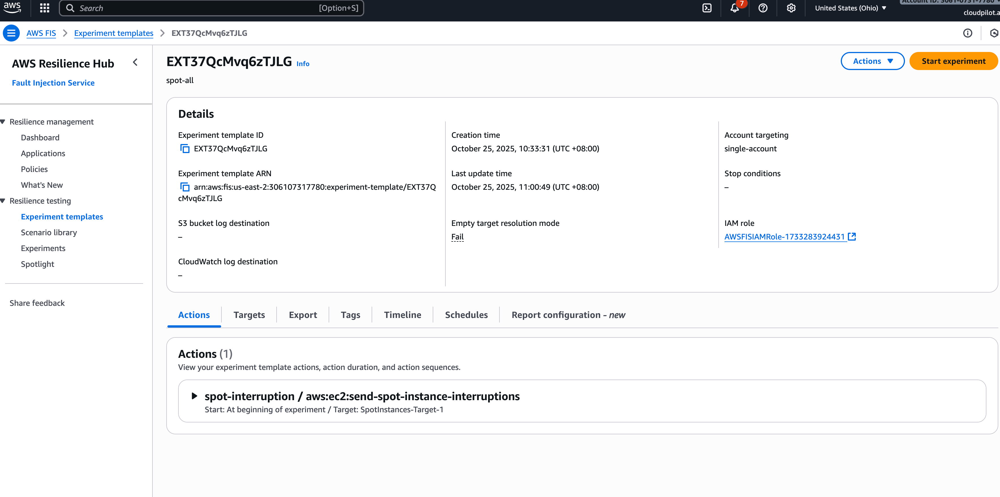

# Testing EC2 Spot Instance Interruptions for Stability

When using EC2 Spot Instances in AWS EKS, you may be concerned about application stability during spot interruptions. This guide demonstrates how to test the resilience of your web services when spot instance interruptions occur within CloudPilot AI, ensuring that your applications can handle these events gracefully.

## Prerequisites

Before starting this testing procedure, ensure you have:

- CloudPilot AI is installed in an AWS EKS cluster with spot instances enabled
- `kubectl` configured to access your cluster
- Access to AWS Fault Injection Simulator (FIS)

## Overview

This testing methodology involves deploying a sample nginx application with multiple replicas(You can scale it to 1) and using a load testing tool to generate concurrent requests while simulating spot instance interruptions. The goal is to verify that your application maintains service availability and responds correctly during interruption events.

The testing setup includes:

1. **Test Application**: An nginx deployment with configurable replicas
2. **Load Testing Tool**: A concurrency testing program to generate continuous requests
3. **Interruption Simulation**: AWS FIS to trigger spot instance interruptions
4. **Monitoring**: Real-time response monitoring to validate service stability

## Deploy Test Applications

### 1. Deploy the Test Web Service

Create the nginx deployment and service using the following configuration:

```yaml
apiVersion: apps/v1
kind: Deployment
metadata:
  name: nginx
  labels:
    app: nginx
spec:
  replicas: 2
  selector:
    matchLabels:
      app: nginx
  template:
    metadata:
      labels:
        app: nginx
    spec:
      containers:
        - name: nginx
          image: nginx:1.27-alpine
          ports:
            - containerPort: 80
          resources:
            requests:
              cpu: 50m
              memory: 64Mi
            limits:
              cpu: 200m
              memory: 128Mi
---
apiVersion: v1
kind: Service
metadata:
  name: nginx
  labels:
    app: nginx
spec:
  selector:
    app: nginx
  ports:
    - name: http
      port: 80
      targetPort: 80
  type: ClusterIP
```

### 2. Deploy the Load Testing Tool

Deploy the concurrency testing program that will generate continuous requests:

```yaml
apiVersion: apps/v1
kind: Deployment
metadata:
  name: hey
  labels:
    app: hey
spec:
  replicas: 1
  selector:
    matchLabels:
      app: hey
  template:
    metadata:
      labels:
        app: hey
    spec:
      containers:
        - name: hey
          image: cesign/heypod:v0.0.1
          imagePullPolicy: IfNotPresent
          command: ["sleep", "infinity"]
          resources:
            requests:
              cpu: 50m
              memory: 64Mi
            limits:
              cpu: 200m
              memory: 128Mi
```

Apply both configurations to your cluster:

```bash
kubectl apply -f nginx-deployment.yaml
kubectl apply -f hey-deployment.yaml
```

Wait for all pods to be in the `Running` state before proceeding with the test.


## Verify Pod Distribution

Before initiating the interruption test, verify that your nginx pods are distributed across different nodes to ensure effective testing:

```bash
kubectl get pods -o wide -l app=nginx
```

Expected output:
```
NAME                     READY   STATUS    RESTARTS   AGE   IP           NODE                                        NOMINATED NODE   READINESS GATES
nginx-658b665857-pt6b8   1/1     Running   0          26m   10.0.0.37    ip-10-0-10-173.us-east-2.compute.internal   <none>           <none>
nginx-658b665857-sq4nw   1/1     Running   0          18m   10.0.33.33   ip-10-0-42-184.us-east-2.compute.internal   <none>           <none>
```

CloudPilot AI will automatically schedule the pods to different nodes to ensure stability.

## Simulate Spot Instance Interruption

Use AWS Fault Injection Simulator (FIS) to trigger spot instance interruptions on your target nodes:

1. Navigate to the AWS FIS console
2. Create a new experiment targeting the EC2 instances running your nginx pods
3. Configure the spot interruption action

<div style={{ textAlign: 'center', width: '90%', borderRadius: '8px', overflow: 'hidden', justifyContent: 'center' }}>
  
</div>

For detailed instructions on setting up spot interruption experiments, refer to the [AWS FIS Spot Interruption Tutorial](https://docs.aws.amazon.com/fis/latest/userguide/fis-tutorial-spot-interruptions.html).

## Monitor Application Performance During Interruption

### 1. Start Load Testing

First, identify the load testing pod and execute the concurrency testing tool:

```bash
# Get the load testing pod name
kubectl get pods -l app=hey

# Execute the load testing command
kubectl exec <hey-pod-name> -it -- sh
```

Inside the pod, run the load testing command:

```bash
hey -c 10 -z 180s http://nginx.default.svc.cluster.local
```

This command will:
- Use 10 concurrent workers (`-c 10`)
- Run for 180 seconds (`-z 180s`)
- Target the nginx service endpoint

### 2. Expected Test Results

A successful test run should show results similar to the following:

```bash
Summary:
  Total:	1.0334 secs
  Slowest:	0.0996 secs
  Fastest:	0.0003 secs
  Average:	0.0082 secs
  Requests/sec:	1212.5028

  Total data:	770595 bytes
  Size/request:	615 bytes

Response time histogram:
  0.000 [1]	|
  0.010 [1117]	|■■■■■■■■■■■■■■■■■■■■■■■■■■■■■■■■■■■■■■■■
  0.020 [30]	|■
  0.030 [5]	|
  0.040 [0]	|
  0.050 [0]	|
  0.060 [0]	|
  0.070 [0]	|
  0.080 [46]	|■■
  0.090 [36]	|■
  0.100 [18]	|■

Latency distribution:
  10% in 0.0006 secs
  25% in 0.0012 secs
  50% in 0.0013 secs
  75% in 0.0015 secs
  90% in 0.0162 secs
  95% in 0.0791 secs
  99% in 0.0902 secs

Details (average, fastest, slowest):
  DNS+dialup:	0.0000 secs, 0.0000 secs, 0.0060 secs
  DNS-lookup:	0.0000 secs, 0.0000 secs, 0.0046 secs
  req write:	0.0000 secs, 0.0000 secs, 0.0002 secs
  resp wait:	0.0079 secs, 0.0002 secs, 0.0995 secs
  resp read:	0.0002 secs, 0.0000 secs, 0.0898 secs

Status code distribution:
  [200]	1253 responses
```

### 3. Analyze Results

**Success Criteria:**
- All responses return HTTP status code 200
- Service remains available throughout the test duration

If all responses show status code 200, your application successfully handled the spot instance interruption without service degradation.

## Conclusion

CloudPilot AI implements advanced mechanisms to ensure application stability during spot instance interruptions. For more information about our spot instance optimization strategies, visit our [blog post on CloudPilot AI](https://www.cloudpilot.ai/en/blog/karpenter-cloudpilot-ai/).
