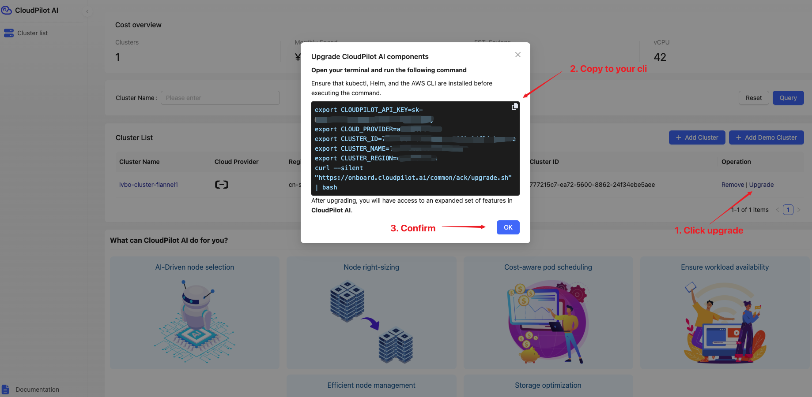

# Upgrade Guide

This document provides a comprehensive, step-by-step guide to upgrading the CloudPilot AI system. It is intended for DevOps engineers, platform operators, and system administrators who manage CloudPilot AI deployments in Kubernetes environments. Following this guide ensures you can efficiently upgrade to the latest version and benefit from new enhancements and optimizations.

## Prerequisites

Before you begin the upgrade process, ensure the following conditions are met:
- Your current CloudPilot AI version supports a direct upgrade. You can verify your version by logging into the [CloudPilot AI Console](https://console.cloudpilot.ai).
- Your environment has the necessary tools installed:
  - `kubectl`: for Kubernetes cluster interactions
  - `helm`: for managing Kubernetes applications
  - `curl`: for fetching remote resources
- You have access to the API key and cluster credentials.

If your current version is outdated, the upgrade script will automatically perform a step-by-step update without skipping any minor versions.

## Step 1: Fetch and Execute the Upgrade Script

### Fetch the Script
Visit the [CloudPilot AI Upgrade Page](https://console.cloudpilot.ai) to download the latest version of the upgrade script. Ensure you select the correct script corresponding to your Kubernetes environment.

### Execute the Script
Connect to your CloudPilot AI cluster, open your terminal, and run the downloaded upgrade script.
The script will automatically:
- Verify the current deployed version
- Download required resources
- Perform the upgrade
- Confirm pod status

No manual intervention is required unless an error is reported.

## Step 2: Verify the Upgrade

Once the script completes:
- Log back into the [CloudPilot AI Console](https://console.cloudpilot.ai).
- Confirm that all pods are running correctly.
- Verify that the system is operating normally and that the version reflects the upgrade.

If any issues arise during verification, refer to the script output logs for troubleshooting or contact CloudPilot AI support.

## More

The CloudPilot AI upgrade script performs the following actions:

### Version Check and Upgrade
The script checks the currently deployed `cloudpilot-agent` version.
- If your version is already up to date, the script will notify you and exit without making changes.
- If your version is outdated, the script will upgrade to the latest version step-by-step, ensuring no minor version is skipped.

### Component Upgrade
CloudPilot AI components are upgraded in two phases:
- **Phase 1**: Core agent in the `cloudpilot` namespace.
- **Phase 2**: Scheduling and optimization components installed via Helm.

The script automatically detects installed components:
- If Phase 2 is detected, it triggers the remote Phase 2 upgrade script.
- Regardless of Phase 2 status, Phase 1 YAML manifests are always applied to ensure the core agent is current.

### Resource Fetching
The script uses `curl` to download:
- Phase 2 installation scripts
- Phase 1 manifest YAML files

All necessary resources are applied to your cluster without manual intervention.

### Pod Status Verification
After applying updates, the script monitors the pods in the `cloudpilot` namespace:
- It waits until all pods reach the `Ready` state.
- If pods are not ready within 10 minutes, the script terminates and reports an error.

### Scope of Upgrade
The upgrade process only affects resources within the `cloudpilot` namespace. Other cluster namespaces and workloads remain unaffected and continue operating normally during the upgrade.

For advanced scenarios such as custom namespace deployments, staged rollouts, or integration with GitOps workflows, please reach out to CloudPilot AI support for tailored assistance.