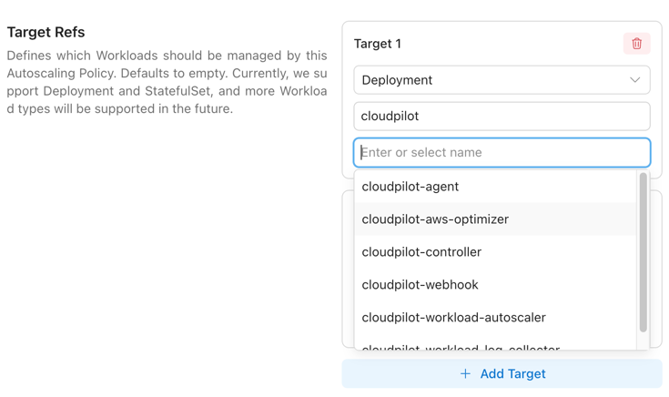
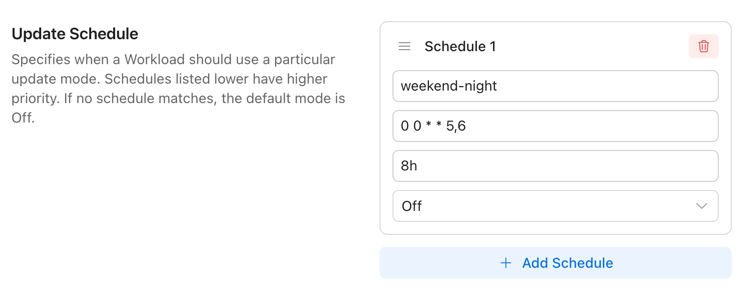
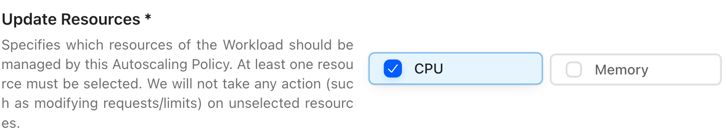

# AutoscalingPolicy

**AutoscalingPolicy** defines **which Workloads** should have their **Requests and Limits** automatically adjusted, **when** these adjustments should occur, and **how** they should be applied.
By properly configuring a AutoscalingPolicy, you can continuously adjust the Requests of a group of Workloads to a reasonable and efficient level.

> **Note:** If a Pod contains sidecar containers (e.g., Istio), we won’t modify them, and they will be excluded from recommendation calculations. We detect sidecars by diffing the container names between the workload’s Pod template and the actual Pod; any names that exist only in the Pod are treated as injected sidecars.

## Enable*

**Enable** toggles whether an **AutoscalingPolicy** is active (enabled by default).

When set to Disabled, the policy is removed from the cluster and retained only on the server. This operation effectively deletes the **AutoscalingPolicy** and will trigger the **On Policy Removal** actions.

## Priority

When multiple AutoscalingPolicy match the same Workload, **Priority** determines which policy takes precedence.

- A AutoscalingPolicy with a **higher Priority** value will be applied first.
- If two AutoscalingPolicies have the **same Priority**, the one created earlier will be applied.

The **Priority** field allows you to flexibly apply AutoscalingPolicies across your workloads.

For example:

- You can configure a AutoscalingPolicy with **Priority = 0** that matches most or even all Workloads but does not actively adjust them.
- Then, you can define additional AutoscalingPolicies with **higher Priority values** to target specific Workloads with more aggressive adjustment strategies.

## Recommendation Policy Name*

The **RecommendationPolicyName** specifies which **Recommendation Policy** the AutoscalingPolicy should use to calculate recommendations.
It defines both the calculation method and the applicable scope.

For details, see [Recommendation Policy](./recommendation_policy).

## TargetRefs

**TargetRefs** specify the scope of Workloads to which the AutoscalingPolicy applies.
You can configure multiple TargetRefs to cover a broader set of Workloads.

| Field          | Allowed Values                     | Required | Description                                                                                                                   |
|----------------|------------------------------------|----------|-------------------------------------------------------------------------------------------------------------------------------|
| **Kind**       | `Deployment` \| `StatefulSet`      | Yes      | Type of Workload. Currently supports `Deployment` and `StatefulSet`.                                                          |
| **Name**       | Any valid Workload name \| *empty* | No       | Name of the Workload. If left empty, it matches **all Workloads** within the namespace or cluster (depending on `Namespace`). |
| **Namespace**  | Any valid namespace \| *empty*     | No       | Namespace of the Workload. If left empty, it matches **all namespaces** in the cluster.                                       |

**Name and Namespace support shell-style glob patterns** (*, ?, and character classes like [a-z]); patterns match the entire value, and an empty field (or *) matches all.

| Pattern           | Meaning                             | Matches                  | Doesn’t match      |
|-------------------|-------------------------------------|--------------------------|--------------------|
| `*`               | Any value                           | `web`, `ns-1`, `default` | —                  |
| `web-*`           | Values starting with `web-`         | `web-1`, `web-prod-a`    | `api-web-1`        |
| `*-prod`          | Values ending with `-prod`          | `core-prod`, `a-prod`    | `prod-core`        |
| `front?`          | `front` + exactly 1 char            | `front1`, `fronta`       | `front10`, `front` |
| `job-??`          | `job-` + exactly 2 chars            | `job-01`, `job-ab`       | `job-1`, `job-001` |
| `ns-[0-9][0-9]-*` | `ns-` + two digits + `-` + anything | `ns-01-a`, `ns-99-x`     | `ns-1-a`           |
| `db[0-2]`         | `db0`, `db1`, or `db2` only         | `db0`, `db2`             | `db3`, `db-2`      |
| `[^0-9]*`         | Does **not** start with a digit     | `app1`, `ns-x`           | `9-app`            |

## Update Schedule

**UpdateSchedule** defines **when** a Workload should use a particular update mode.

- Items listed **later in the schedule** have higher priority.
- If no schedule matches, the default mode is `Off`.

By configuring multiple Update Schedule Items, you can apply different update modes at different times.
For example:

- During the day, only allow updates using the `OnCreate` mode.
- At night, allow updates using the `ReCreate` mode.

### Update Schedule Item

| Field             | Allowed Values / Format                        | Description                                                                                                                             |
|-------------------|------------------------------------------------|-----------------------------------------------------------------------------------------------------------------------------------------|
| `Name`            | Any non-empty string                           | Human-readable name of this schedule item.                                                                                              |
| `Cron Expression` | Cron expression (e.g., `0 2 * * *`)            | Start time defined by a cron schedule. Must follow standard cron syntax. Must be **provided together with** `Duration`.                 |
| `Duration`        | Go/K8s duration string (e.g., `30m`, `1h`)     | Length of time the `Update Mode` remains active after `Cron Expression` triggers. Must be **provided together with** `Cron Expression`. |
| `Update Mode`     | `OnCreate` \| `ReCreate` \| `InPlace` \| `Off` | Update behavior to apply when this item is active.                                                                                      |
| `Timezone`        | IANA Time Zone name                            | Time zone for interpreting the `Cron Expression` field. Defaults to `UTC` if not specified.                                             |

**Constraint:** `Cron Expression` and `Duration` are **jointly optional** — either **both present** (time-windowed rule) or **both absent** (always applicable rule with the specified `mode`).

You can visit [here](https://crontab.cronhub.io/) to refer to how the Cron syntax of the `Cron Expression` field works.

### UpdateMode

| Value      | Behavior                                              | Typical Use Case                                                                |
|------------|-------------------------------------------------------|---------------------------------------------------------------------------------|
| `OnCreate` | Apply changes only when new Pods are created.         | Safe, no disruption to existing Pods.                                           |
| `ReCreate` | Apply changes by recreating Pods (rolling replace).   | When in-place vertical changes are not supported or a clean restart is desired. |
| `InPlace`  | Apply changes in place to running Pods (no recreate). | Minimal disruption on clusters that support in-place resource updates.          |
| `Off`      | Do not apply changes (disabled).                      | Temporarily pause updates.                                                      |

When the `UpdateMode` is set to either `ReCreate` or `InPlace`, the `OnCreate` mode will also be applied automatically. This ensures that when a Pod restarts normally, the newly created Pod will always receive the latest recommendations, regardless of the Drift Thresholds.

For `ReCreate` operations, when attempting to evict a **single-replica** Deployment **without PVCs**, we perform a **rolling update** to avoid service interruption during the update.

> **Note:** The `InPlace` mode has certain limitations and may automatically fall back to `ReCreate` in some cases. For details, see [InPlace Limitations](./best_practices_and_limitations#inplace-update-mode-limitations).

## Update Resources*

**UpdateResources** defines which resources should be managed by the Workload Autoscaler.
Available resources: `CPU` / `Memory`.

- You must select at least one resource.
- Only the selected resources will be actively updated.
- This setting does **not** affect how recommendations are calculated.

If you don’t have specific requirements or if you already use `HPA`, we recommend allowing **both `CPU` and `Memory`** to be managed.

> **Note:** When you modify the `Update Resources`, an update operation may be triggered based on the deviation between the recommended value and the current value. This operation will take effect immediately once the conditions of the `Update Schedule` are met.

## Drift Thresholds

**DriftThresholds** define the deviation between the recommended value and the current value that should trigger an active update.

- You can configure this as either a **percentage** or an **absolute value**.
- The default is **10%**.

| Resource Type | Percentage | Absolute Value (Option 1) | Absolute Value (Option 2) |
|---------------|------------|---------------------------|---------------------------|
| **CPU**       | `20%`      | `0.5`                     | `200m`                    |
| **Memory**    | `10%`      | `0.25Gi`                  | `500Mi`                   |

If the deviation for **any resource** in a Pod exceeds the threshold, the Pod will be actively updated.

## On Policy Removal

**OnPolicyRemoval** defines how Pods are rolled back when a AutoscalingPolicy is removed.
- The default is `Off`: the configuration will be deleted, but no action will be taken on existing Pods.

| Value      | Behavior on policy removal                                                                     | Business impact             | Recommended scenarios                                                                        | Notes                                                                                                     |
|------------|------------------------------------------------------------------------------------------------|-----------------------------|----------------------------------------------------------------------------------------------|-----------------------------------------------------------------------------------------------------------|
| `Off`      | Delete the EVPAC configuration only; **do not** roll back Pod **requests** (status quo).       | No restart, zero downtime   | When rollback is not required; keep current resource settings after troubleshooting.         | **Limits** are unchanged. This option makes no changes to requests/limits.                                |
| `ReCreate` | Roll back to the pre-policy **requests** by **recreating** target Workloads (rolling replace). | Restarts, brief downtime    | Cluster does not support in-place vertical changes; require scheduler to reassign resources. | Ensure safe rolling strategy. **Limits** typically remain unchanged unless your controller handles them.  |
| `InPlace`  | Roll back to the pre-policy **requests** via **in-place** Pod updates (no recreate).           | Usually zero/low disruption | Cluster supports in-place vertical resizing; prioritize minimal disturbance.                 | Requires cluster/runtime support for in-place updates. **Limits** unchanged unless otherwise implemented. |

For `ReCreate` operations, when attempting to evict a **single-replica** Deployment **without PVCs**, we perform a **rolling update** to avoid service interruption during the update.

> **Note:** The `InPlace` mode has certain limitations and may automatically fall back to `ReCreate` in some cases. For details, see [InPlace Limitations](./best_practices_and_limitations#inplace-update-mode-limitations). When unexpected situations prevent us from restoring the Pod Request for 10 minutes, we will allow the configuration to be deleted directly without restoring the Pod Request.

## Limit Policy*

**LimitPolicy** defines how Pod limits should be reset.
By default, **we recommend using `RemoveLimit`** to ensure that a Workload can occasionally preempt more resources when needed.

When using Multiplier, we suggest setting a reasonable lower bound for `CPU`/`Memory` recommendations. In rare cases (e.g., in testing environments where actual usage is extremely low), the recommended values may not be sufficient for stable Pod startup or handling sudden traffic spikes.

| Field         | Behavior                                                                   |
|---------------|----------------------------------------------------------------------------|
| `RemoveLimit` | Remove Pod `limits` (no CPU/Memory caps).                                  |
| `KeepLimit`   | Keep existing Pod `limits` unchanged.                                      |
| `Multiplier`  | Recalculate `limits` by multiplying with the recommendation request value. |

When you modify the `Limit Policy`, an update operation may be triggered. This decision is based on the deviation between the current values and the recommended values, as well as whether existing Pods have their limits set according to the expected configuration. Once the conditions of the `Update Schedule` are met, the update will take effect immediately.

> **Note:** When using `KeepLimit`, the final recommended values will never exceed your configured Limits. If you want Pods to be able to use more resources in certain cases, consider using `RemoveLimit` or `Multiplier` instead.
