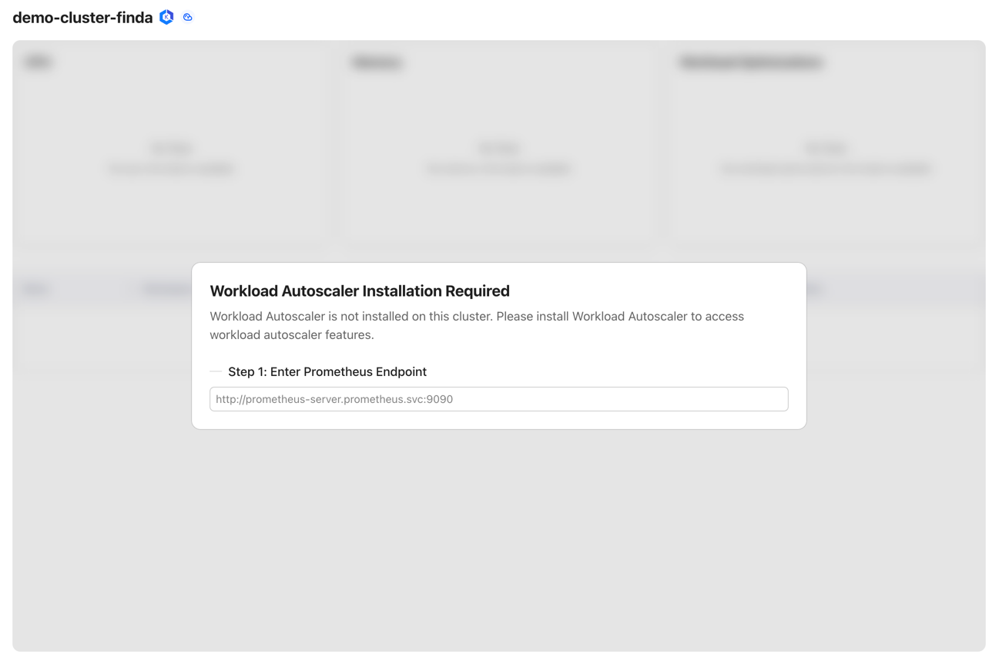

# Workload Autoscaler Installation

This document provides a guide to help you install the `CloudPilot AI Workload Autoscaler` component.

You can view the list of permissions required by the `Workload Autoscaler` component through this link: [Workload Autoscaler Permissions](../security/permissions_required.mdx#workload-autoscaler-additional-permissions)

## Prometheus Requirement

The Workload Autoscaler requires `Prometheus` as a data source to retrieve cluster resource usage,
such as container CPU usage and CPU requests.

If you haven’t deployed Prometheus yet, you can install it using the following command. When installed via the Helm Chart,
`Prometheus` will automatically collect all the required data by default.

```shell
# Configure the storage class for Prometheus, if you have a default storage class, you can leave it empty
export STORAGE_CLASS=""

kubectl create namespace prometheus
helm repo add prometheus-community https://prometheus-community.github.io/helm-charts

helm upgrade -i prometheus prometheus-community/prometheus \
    --namespace prometheus \
    --set alertmanager.persistence.storageClass="${STORAGE_CLASS}" \
    --set server.persistentVolume.storageClass="${STORAGE_CLASS}"
```

You can then use the following address as the Prometheus endpoint:
`http://prometheus-server.prometheus.svc`

If you have already deployed `Prometheus`, you need to run the following PromQL to ***verify that `Prometheus` is correctly
collecting the metrics required by `CloudPilot AI`***.

```
# Usage datas is collected from the kubelet-cadvisor.
rate(container_cpu_usage_seconds_total{
  container!="", container!="POD",
  namespace="kube-system",
  pod=~"coredns.*"
}[5m])

# Request and Limit datas are collected from the kube-state-metrics component.
kube_pod_container_resource_requests{
  resource="cpu",
  container!="",
  namespace="kube-system",
  pod=~"coredns.*"
}
```

If Prometheus is deployed but not collecting the required metrics, you can contact our technical support team for
assistance with the deployment process.

## Installation

Once `Prometheus` and the corresponding data sources are ready, you can begin deploying the `Workload Autoscaler`
component from the `Optimization` page.



If you are unsure of your `Prometheus` endpoint, please reach out to our technical support team for guidance.

By default, after deployment the `Workload Autoscaler` will automatically calculate recommendations for certain workloads but will not apply updates.
Once the deployment is complete, you can configure a AutoscalingPolicy and RecommendationPolicy to update strategies and adjust workload recommendations.

## Upgrade and Uninstall

The `Workload Autoscaler` component is upgraded together with the `CloudPilot AI` version—you do not need to upgrade
it separately.

Similarly, the `Workload Autoscaler` component is uninstalled together with the `CloudPilot AI`. If you need
to uninstall the `Workload Autoscaler` component independently, please contact our technical support team for assistance.

> **Note:** Before uninstalling the Workload Autoscaler, please make sure that all AutoscalingPolicies have been deleted or disabled, and confirm that all Workloads have been restored to their original state.

## Configure the Update/Evict Limiter

By default, the **Workload Autoscaler** enables a **Limiter** that throttles the number of **in-place updates** and **Pod evictions**. This helps prevent large clusters from becoming unstable when many Pods are updated or evicted in a short period.

You can tune the Limiter with the environment variables below. If not set, the defaults apply.

| ENV var                    | Default | What it controls                                                               |
|----------------------------|---------|--------------------------------------------------------------------------------|
| `LIMITER_QUOTA_PER_WINDOW` |   **5** | Tokens added to the bucket each window.                                        |
| `LIMITER_BURST`            |  **10** | Maximum tokens allowed in the bucket (peak operations within a window).        |
| `LIMITER_WINDOW_SECONDS`   |  **30** | Window length in seconds; every window adds `LIMITER_QUOTA_PER_WINDOW` tokens. |

> **Note:** For eviction operations, when attempting to evict a **single-replica** Deployment **without PVCs**, we perform a **rolling update** to avoid service interruption during the update.
