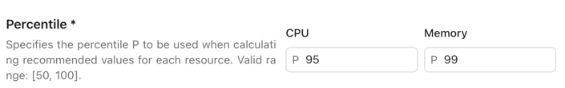
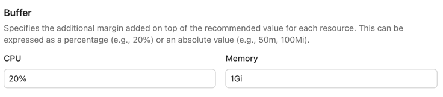
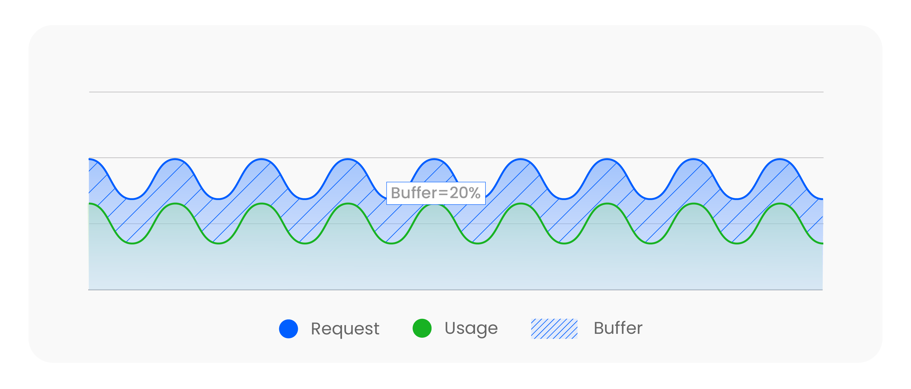
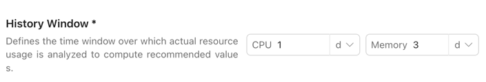
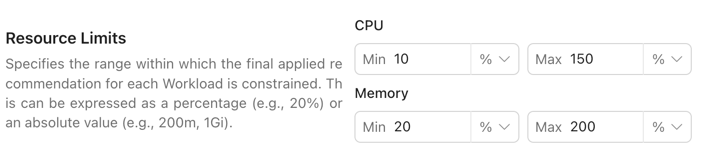

# Recommendation Policy

`Recommendation Policy` is used to configure the recommendation strategy of the `Workload Autoscaler`.
It allows you to define the range of recommendation values, enabling more flexible resource management.

This document explains the meaning and valid range of each field in the `Recommendation Policy`.

> **Note:** Fields marked with * are required.

## Strategy Type*

`StrategyType` defines the type of recommendation strategy. Currently, we only provide the `Percentile` strategy type.
Additional strategy types will be available in the future.

## Percentile

When `StrategyType` is set to `Percentile`, this configuration is required. You need to specify a `Percentile` value for
both `CPU` and `Memory`. The range of `Percentile` is from `P50` to `P100`.

The `Percentile` is a statistical metric that indicates the percentage of data points in a dataset that fall below or equal to a given value.

We recommend choosing an appropriate `Percentile` value based on the characteristics and requirements of your workload.
Below are some commonly used Percentile values and their typical use cases:

| Percentile | Explanation                                          | Typical Use Cases                                                                                           |
|------------|------------------------------------------------------|-------------------------------------------------------------------------------------------------------------|
| **P50**    | Median; covers about half of usage                   | Development/testing environments; cost-sensitive; high utilization; occasional resource shortage acceptable |
| **P70**    | Slightly more conservative; covers most common loads | General online services; moderate performance requirements; small degree of oversubscription acceptable     |
| **P90**    | More robust; covers most situations                  | Recommended value for most production services; balances performance and cost                               |
| **P95**    | Close to worst-case; handles rare spikes             | Core services; systems with high stability requirements                                                     |
| **P99**    | Covers nearly all cases; may be oversized            | Critical services such as finance, payments, or trading where stability is paramount                        |

> **Note:** In general, we recommend setting the **Memory Percentile** to at least **P90** or higher, while the **CPU Percentile** can be configured more flexibly.

## Buffer

`Buffer` is used to add a margin on top of the recommended value to handle burst traffic or sudden resource demands.
You can configure `Buffer` separately for `CPU` and `Memory`.

`Buffer` values can be specified as either ***a percentage or an absolute value***:

| Resource Type | Percentage | Absolute Value (Option 1) | Absolute Value (Option 2) |
|---------------|------------|---------------------------|---------------------------|
| **CPU**       | `20%`      | `0.5`                     | `200m`                    |
| **Memory**    | `10%`      | `0.25Gi`                  | `500Mi`                   |

When the buffer is a percentage, it is directly multiplied by each container’s recommendation to obtain the final value.
When the buffer is an absolute value, if every container has a configured request, the buffer is allocated according to each container’s share of the total pod request.
If not all containers have requests configured, the buffer is allocated based on each container’s proportion of the total pod recommendation.

## History Window*

`History Window` defines the time window of historical data used to calculate the recommended values.
It specifies the duration of resource usage data that will be considered during recommendation calculations.

In most cases, we recommend setting the history window to 1–3 days.

- A shorter window may fail to capture long-term workload trends.

- A longer window may make recommendations less flexible.

For critical workloads, you can set it to 7 days to ensure recommendations account for a wider range of usage scenarios.

| History Window | Characteristics                                       | Pros                                                                         | Cons                                                                                 |
|----------------|-------------------------------------------------------|------------------------------------------------------------------------------|--------------------------------------------------------------------------------------|
| **6h**         | Very short window; captures recent workload changes   | Highly responsive to traffic spikes and short-term patterns                  | Recommendations change frequently, which may cause pods to be rescheduled more often |
| **3d**         | Balanced window; captures recent and mid-term trends  | Good balance between stability and adaptability; suitable for most workloads | May not fully capture long-term variations                                           |
| **7d**         | Long window; covers a wide range of workload patterns | More stable recommendations; safer for critical workloads                    | Less flexible, may respond slowly to sudden changes                                  |

> **Note:** When the source data (Prometheus Pod usage metrics) is insufficient, the Workload Autoscaler will compute using whatever data is available, which may result in recommendations that are lower or higher than expected.

## Resource Limits

You can set both `Min` and `Max` limits for `CPU` and `Memory`. This ensures that the recommended values will not fall below or exceed the range you define.

The `Max limit` is applied after the `Buffer` is calculated, meaning the final recommended value (including the `Buffer`) will not exceed the `Max limit`.

For `Resource Limits`, you can use either percentages or absolute values:

| Resource Type | Percentage | Absolute Value 1 | Absolute Value 2 |
|---------------|------------|------------------|------------------|
| **CPU**       | `20%`      | `0.5`            | `100m`           |
| **Memory**    | `10%`      | `1Gi`            | `500Mi`          |

In most cases, we recommend ***using percentages so the system can adjust based on your original Request configuration***.
For example, if you set `CPU` to `30%` ~ `200%`, the final recommended value will never be lower than `30%` of the original Request,
nor higher than `200%` of the original Request.

> **Note:** When using percentages for `Resource Limits`, you must ensure that all containers within the workloads governed by this `Recommendation Policy` have defined Request values for the corresponding resource. Otherwise, the system will not be able to calculate a recommendation.

## Evaluation Period*

`Evaluation Period` defines the time window used to evaluate recommendations. This is specified as a duration, and you can configure it in minutes or seconds.
In most cases, we recommend setting it between `30s` and `5m`.
